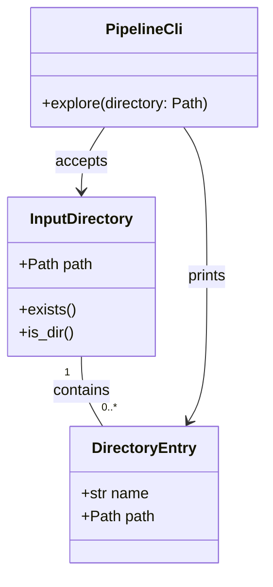

# CLI Directory Listing

## Requirements

Implement a small Typer CLI command named `explore` that accepts a directory path from the user and prints the full paths of the directory's immediate child entries, establishing the first filesystem-oriented pipeline slice without adding USD validation, recursive scanning, or Unreal integration.

## Entities

## Approach

1. CLI command extension:
   - Extend the existing Typer application in `main.py`.
   - Add a command named `explore`, backed by a Python function named `explore`.
   - Keep the existing `hello` command unchanged.

2. Filesystem behavior:
   - Accept one required directory argument.
   - Treat the argument as a local filesystem path.
   - Print only immediate child entries of the provided directory.
   - Print each entry's full path, one per line, in filesystem iteration order.

3. Error and boundary handling:
   - If the path does not exist, show a clear Typer error and exit with a non-zero status.
   - If the path exists but is not a directory, show a clear Typer error and exit with a non-zero status.
   - If the directory is empty, print nothing and exit successfully.
   - Do not add USD-specific validation in this slice.

## Structure

### Inheritance Relationships

1. `app` remains a `typer.Typer` application instance.
2. `hello` remains an existing Typer command function.
3. `explore` is added as a new Typer command function.

### Dependencies

1. `main.py` depends on Typer for CLI registration, output, and user-facing errors.
2. `main.py` depends on Python standard library path handling for filesystem operations.
3. `explore` reads immediate directory entries and prints their full paths through Typer output.

### Layered Architecture

1. CLI Layer: `main.py` owns command registration and command arguments.
2. Filesystem Interaction: The new command performs minimal direct path inspection for this first slice.
3. Future Extraction Boundary: If directory scanning or validation grows, extract filesystem behavior out of `main.py` in a later SPDD cycle.

## Operations

### Update CLI Module - `main.py`

1. Responsibility: Add a minimal command for listing directory contents while preserving the existing Typer app.
2. Imports:
   - Add standard library `Path` support from `pathlib`.
   - Keep the existing Typer import.
3. Methods:
   - `explore(directory: Path) -> None`
     - Logic:
       - Receive the directory path from the CLI as a required argument.
       - Check whether the path exists.
       - If it does not exist, raise a Typer user-facing error with the message `Directory does not exist: {directory}`.
       - Check whether the path is a directory.
       - If it is not a directory, raise a Typer user-facing error with the message `Path is not a directory: {directory}`.
       - Read the directory's immediate child entries.
       - Print each entry's full path on its own line, in filesystem iteration order.
       - If there are no entries, print nothing and return successfully.
4. Annotations:
   - Register `explore` with `@app.command()`.
5. Constraints:
   - Do not recursively scan nested directories.
   - Do not filter by USD extension.
   - Do not add a new package/module structure yet.
   - Do not remove or rename the existing `hello` command.

### Validate CLI Behavior

1. Responsibility: Confirm the command is callable through the existing project CLI.
2. Checks:
   - Run the command against a directory with known contents and verify the child entry full paths are printed.
   - Run the command against a missing path and verify it fails with `Directory does not exist: {directory}`.
   - Run the command against a file path and verify it fails with `Path is not a directory: {directory}`.
   - Run lints or diagnostics for `main.py`.
3. Constraints:
   - Use `uv run` for Python command execution when possible.

## Norms

1. CLI framework:
   - Use Typer for command registration, output, and user-facing CLI errors.
   - Prefer `typer.echo` for command output.
   - Prefer Typer exceptions for invalid user input instead of raw tracebacks.

2. Python style:
   - Use type annotations on command function parameters and return values.
   - Use `pathlib.Path` for filesystem paths.
   - Keep command functions short and readable.
   - Avoid adding abstractions before the behavior requires them.

3. Project tooling:
   - Use `uv run` for local command execution.
   - Keep dependencies in `pyproject.toml`.
   - Do not add third-party dependencies for simple filesystem listing.

4. Documentation and comments:
   - Keep docstrings concise.
   - Add comments only if the logic becomes non-obvious.

## Safeguards

1. Functional constraints:
   - The command must be named `explore`.
   - The command must accept exactly one required directory path argument.
   - The command must print immediate child entry full paths only.
   - Output order follows filesystem iteration order; do not sort entries by name.

2. Scope constraints:
   - No USD file validation in this slice.
   - No recursive directory traversal in this slice.
   - No Unreal integration in this slice.
   - No project package restructuring in this slice.

3. Error constraints:
   - Missing paths must fail clearly with `Directory does not exist: {directory}`.
   - Non-directory paths must fail clearly with `Path is not a directory: {directory}`.
   - Empty directories must be treated as successful and produce no listed entries.

4. Compatibility constraints:
   - Keep the existing `hello` command working.
   - Keep the existing `pipeline` console script entry in `pyproject.toml`.
   - Use cross-platform path handling compatible with Windows paths.

5. Verification constraints:
   - Check `main.py` diagnostics after editing.
   - Run at least one successful command invocation and one invalid-input invocation if the environment can execute `uv run`.

