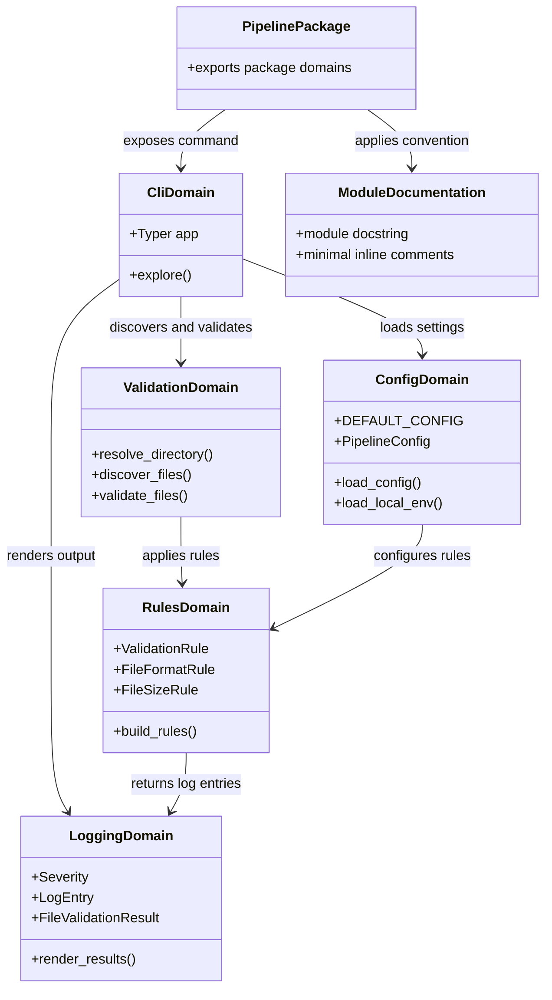

# Package Organization and Comments

## Requirements

Refactor the `pipeline` package into clearer domain-oriented Python packages while preserving current CLI behavior, adopting idiomatic Python module naming, and adding minimal human-oriented module context without noisy line-by-line comments.

## Entities

## Approach

1. Package organization:
   - Move root-level implementation modules into domain packages.
   - Keep `pipeline/__init__.py` lightweight.
   - Preserve the installed console script target `pipeline.cli:app` by making `pipeline/cli/__init__.py` export `app`.

2. Target package layout:
   - `pipeline/cli/__init__.py`: exports the Typer `app`.
   - `pipeline/cli/app.py`: owns Typer application and `explore` command.
   - `pipeline/config/__init__.py`: exports config loading APIs.
   - `pipeline/config/defaults.py`: owns `DEFAULT_CONFIG`.
   - `pipeline/config/models.py`: owns `PipelineConfig`.
   - `pipeline/config/loader.py`: owns JSON config loading and merge behavior.
   - `pipeline/config/environment.py`: owns `.env` loading.
   - `pipeline/logging/__init__.py`: exports log/result models and rendering APIs.
   - `pipeline/logging/models.py`: owns `Severity`, `LogEntry`, `FailedRule`, and `FileValidationResult`.
   - `pipeline/logging/renderer.py`: owns terminal rendering.
   - `pipeline/rules/__init__.py`: exports rule contracts and registry entry points.
   - `pipeline/rules/validation_rule.py`: owns `ValidationRule`.
   - `pipeline/rules/registry.py`: builds enabled rules from config.
   - `pipeline/rules/builtins/__init__.py`: exports built-in rules.
   - `pipeline/rules/builtins/file_format.py`: owns `FileFormatRule`.
   - `pipeline/rules/builtins/file_size.py`: owns `FileSizeRule`.
   - `pipeline/validation/__init__.py`: exports validation workflow helpers.
   - `pipeline/validation/discovery.py`: owns directory resolution and recursive file discovery.
   - `pipeline/validation/runner.py`: owns rule execution and result aggregation.

3. Python naming convention:
   - Use lowercase package and module names.
   - Use `snake_case` module names for multi-word concepts.
   - Keep classes in `PascalCase`.
   - Do not use capitalized module filenames like `ValidationRule.py`.
   - Replace ambiguous `rules/base.py` with clearer `rules/validation_rule.py`.

4. Comment strategy:
   - Add a short module docstring to files whose responsibility is not obvious from the filename alone.
   - Use docstrings as orientation, not detailed implementation commentary.
   - Keep existing useful function docstrings where they clarify public behavior.
   - Add inline comments only for non-obvious design choices.
   - Do not add comments that restate a function name, assignment, or simple control flow.

5. Behavior preservation:
   - Do not change command names, CLI arguments, config schema, default config, validation rules, log output format, or exit code behavior.
   - Update imports and package exports only as needed to support the new layout.
   - Validate with the existing `uv run pipeline explore ...` smoke checks.

## Structure

### Inheritance Relationships

1. `ValidationRule` remains the abstract base class for validation rules.
2. `FileFormatRule` continues to implement `ValidationRule`.
3. `FileSizeRule` continues to implement `ValidationRule`.
4. `Severity` remains the enum for internal rule-level log severities.
5. `LogEntry`, `FailedRule`, and `FileValidationResult` remain data objects.

### Dependencies

1. `pyproject.toml` continues to use `pipeline.cli:app` as the console script entry point.
2. `pipeline/cli/__init__.py` imports and exposes `app` from `pipeline/cli/app.py`.
3. `pipeline/cli/app.py` imports config loading, directory discovery, rule registry, validation runner, and log renderer through domain package exports.
4. `pipeline/config/loader.py` depends on `defaults.py` and `models.py`.
5. `pipeline/config/environment.py` depends on `python-dotenv`.
6. `pipeline/validation/discovery.py` depends on `pipeline.config.environment`.
7. `pipeline/validation/runner.py` depends on `pipeline.logging.models` and `pipeline.rules.validation_rule`.
8. `pipeline/logging/renderer.py` depends on `pipeline.logging.models`.
9. `pipeline/rules/registry.py` depends on `pipeline.config.models`, `pipeline.rules.validation_rule`, and built-in rule modules.
10. Built-in rule modules depend on `pipeline.logging.models` and `pipeline.rules.validation_rule`.

### Layered Architecture

1. CLI Layer: `pipeline/cli/` handles Typer app and command orchestration.
2. Config Layer: `pipeline/config/` handles defaults, JSON overrides, and local environment loading.
3. Validation Layer: `pipeline/validation/` handles discovery and rule execution.
4. Rules Layer: `pipeline/rules/` handles rule contracts, registry, and built-in rule implementations.
5. Logging Layer: `pipeline/logging/` handles validation result models and terminal output rendering.

## Operations

### Create CLI Domain Package - `pipeline/cli/`

1. Responsibility: Move Typer app ownership into a CLI domain package while preserving `pipeline.cli:app`.
2. Files:
   - Create `pipeline/cli/app.py`.
   - Create `pipeline/cli/__init__.py`.
3. Methods:
   - Move current Typer app and `explore` command from `pipeline/cli.py` into `pipeline/cli/app.py`.
   - In `pipeline/cli/__init__.py`, export `app`.
4. Documentation:
   - Add a module docstring to `pipeline/cli/app.py` explaining that it defines the Typer app and command wiring.
5. Constraints:
   - Keep command name `explore`.
   - Keep `directory` and `--config` behavior unchanged.
   - Remove old `pipeline/cli.py` after migration.

### Create Config Domain Package - `pipeline/config/`

1. Responsibility: Split configuration defaults, models, JSON loading, and environment loading into a config domain package.
2. Files:
   - Create `pipeline/config/defaults.py`.
   - Create `pipeline/config/models.py`.
   - Create `pipeline/config/loader.py`.
   - Create `pipeline/config/environment.py`.
   - Create `pipeline/config/__init__.py`.
3. Content moves:
   - Move `DEFAULT_CONFIG` to `defaults.py`.
   - Move `PipelineConfig` to `models.py`.
   - Move `_deep_merge` and `load_config` to `loader.py`.
   - Move `load_local_env` from `pipeline/env.py` to `environment.py`.
4. Documentation:
   - Add module docstrings to `loader.py` and `environment.py`.
   - Avoid adding a docstring to trivial `__init__.py` unless needed for exports.
5. Constraints:
   - Preserve exact config error messages.
   - Preserve default config values.
   - Remove old `pipeline/config.py` and `pipeline/env.py` after migration.

### Create Logging Domain Package - `pipeline/logging/`

1. Responsibility: Group validation result data and terminal rendering under a logging domain.
2. Files:
   - Create `pipeline/logging/models.py`.
   - Create `pipeline/logging/renderer.py`.
   - Create `pipeline/logging/__init__.py`.
3. Content moves:
   - Move `Severity`, `LogEntry`, `FailedRule`, and `FileValidationResult` from `pipeline/log_entry.py` to `models.py`.
   - Move `render_file_result`, `render_summary`, and `render_results` from `pipeline/log_renderer.py` to `renderer.py`.
4. Documentation:
   - Add a module docstring to `renderer.py` because output formatting rules are easier to understand with context.
   - Keep comments minimal; do not comment simple formatting constants unless their purpose is not obvious.
5. Constraints:
   - Preserve exact output alignment and line format.
   - Remove old `pipeline/log_entry.py` and `pipeline/log_renderer.py` after migration.

### Refactor Rules Domain - `pipeline/rules/`

1. Responsibility: Make the rule contract, built-in rules, and registry easier to navigate.
2. Files:
   - Rename conceptual `pipeline/rules/base.py` to `pipeline/rules/validation_rule.py`.
   - Create `pipeline/rules/builtins/__init__.py`.
   - Move `file_format.py` to `pipeline/rules/builtins/file_format.py`.
   - Move `file_size.py` to `pipeline/rules/builtins/file_size.py`.
   - Keep `pipeline/rules/registry.py`.
   - Update `pipeline/rules/__init__.py`.
3. Documentation:
   - Add a module docstring to `validation_rule.py` explaining it defines the rule contract.
   - Add a module docstring to `registry.py` explaining that it maps config to enabled rules.
   - Do not add redundant comments inside simple rule implementations.
4. Constraints:
   - Preserve rule names `file_format` and `file_size`.
   - Preserve validation messages exactly.
   - Remove old `pipeline/rules/base.py`, `pipeline/rules/file_format.py`, and `pipeline/rules/file_size.py` after migration.

### Create Validation Domain Package - `pipeline/validation/`

1. Responsibility: Group file discovery and validation execution under a validation domain package.
2. Files:
   - Create `pipeline/validation/discovery.py`.
   - Create `pipeline/validation/runner.py`.
   - Create `pipeline/validation/__init__.py`.
3. Content moves:
   - Move directory resolution and recursive discovery from `pipeline/discovery.py` to `discovery.py`.
   - Move `validate_files` from `pipeline/validation.py` to `runner.py`.
4. Documentation:
   - Add module docstrings to both files because they define workflow boundary responsibilities.
5. Constraints:
   - Preserve exact directory error messages.
   - Preserve recursive discovery behavior.
   - Preserve validation behavior that does not stop after failures.
   - Remove old `pipeline/discovery.py` and `pipeline/validation.py` after migration.

### Update Imports and Package Exports

1. Responsibility: Make imports reflect the new domain package layout.
2. Updates:
   - Update all imports from old root modules to new package paths.
   - Add `__all__` exports where helpful in `__init__.py` files, but only for public APIs used across domains.
3. Constraints:
   - Do not introduce import cycles.
   - Do not change public CLI behavior.

### Validate Behavior

1. Responsibility: Prove the refactor preserved behavior.
2. Checks:
   - Run diagnostics or lints on `pipeline/`.
   - Run `uv sync`.
   - Run `uv run pipeline --help` and verify `explore` remains available.
   - Run `uv run pipeline explore --help` and verify argument and `--config` behavior remain available.
   - Run `uv run pipeline explore <test-directory>` on a directory with one passing file and one failing file.
   - Verify output remains per-file `PASS` / `FAILED` with indented failed rules.
   - Verify exit code remains `1` when any file fails and `0` when all files pass.

## Norms

1. Python naming:
   - Package and module names must be lowercase.
   - Multi-word module names use `snake_case`.
   - Class names use `PascalCase`.
   - Do not use capitalized filenames to match class names.

2. Module organization:
   - Organize by cohesive domain responsibility, not by one-class-per-file.
   - Prefer descriptive module names such as `validation_rule.py` over vague names like `base.py` when clarity improves.
   - Keep `__init__.py` files focused on exports, not business logic.

3. Comments and docstrings:
   - Use short module docstrings for files whose purpose is not immediately obvious.
   - Keep function docstrings only for public functions or behavior that benefits from orientation.
   - Do not comment obvious assignments, simple branches, imports, or function names.
   - Add inline comments only for non-obvious decisions.

4. Tooling:
   - Use `uv run pipeline ...` for smoke checks.
   - Keep `pyproject.toml` package inclusion unchanged unless validation proves it must change.

## Safeguards

1. Behavior constraints:
   - Do not change `pipeline explore` command name.
   - Do not change CLI arguments or `--config` option.
   - Do not change config schema or default values.
   - Do not change validation rule behavior or messages.
   - Do not change logging output format.
   - Do not change exit code behavior.

2. Refactor constraints:
   - Remove old modules only after replacement imports are updated.
   - Preserve package installability through `uv sync`.
   - Avoid circular imports between domain packages.
   - Keep root `pipeline/` free of implementation modules except package-level `__init__.py`.

3. Documentation constraints:
   - Comments must help a future reader navigate the file.
   - Do not add comments to every function.
   - Do not add verbose top-level comments that duplicate the filename.
   - Prefer module docstrings over top-level `#` comments.

4. Python convention constraints:
   - Do not create files named `ValidationRule.py`, `FileFormatRule.py`, or similar capitalized class names.
   - Do not force one-class-per-file if a cohesive module can hold related objects.

5. Verification constraints:
   - Run lints or diagnostics for changed Python files.
   - Run at least one passing and one failing `pipeline explore` smoke test.
   - Report any behavior deviation before proceeding further.

