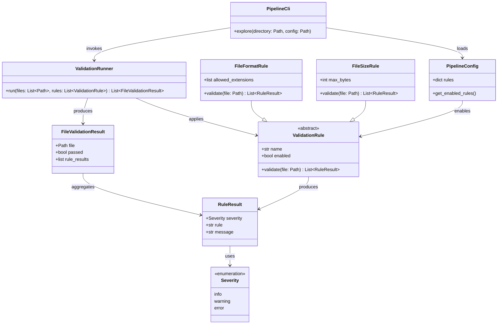

# Modular File Validation

## Requirements

Extend the `explore` command into a discover-and-validate workflow that recursively collects files under a directory, applies a configurable modular set of rules to every discovered file, models rule and file validation results in the validation domain, renders structured per-file pass or failed results with an overall run summary, and supports default plus JSON-based configuration with a general local `.env` file for development variables.

## Entities

## Approach

1. Command evolution:
   - Extend the existing `explore` command rather than introducing a separate validation command.
   - Remove the `hello` command from the CLI.
   - Change `explore` from path-only printing into: resolve directory, recursively discover files, run enabled rules, render structured per-file results, set exit code from results.

2. Modular rule model:
   - Introduce an abstract `ValidationRule` base type with a stable `name` and `validate(file: Path) -> list[RuleResult]` contract.
   - Implement two concrete rules for this slice: `file_format` and `file_size`.
   - Build enabled rules from configuration so unused rules are skipped cleanly.

3. Discovery scope:
   - Recursively discover all files under the provided directory.
   - Include files in nested subdirectories.
   - Do not treat directories themselves as validation targets.

4. Configuration layering:
   - Ship built-in defaults in code.
   - Allow optional JSON configuration via a CLI `--config` option.
   - Merge JSON values over defaults for known rule settings.
   - Fail fast with a clear CLI error if the JSON file is missing or invalid.

5. Local environment file:
   - Load a project-root `.env` file as the general local environment source for pipeline variables.
   - Use `.env` for development shortcuts and future pipeline settings, not only directory resolution.
   - Make the `directory` CLI argument optional.
   - Resolve directory precedence as: explicit CLI argument, then `PIPELINE_DEV_DIRECTORY` from environment, then CLI error if neither is available.

6. Structured logging:
   - Aggregate rule results per file into a `FileValidationResult`.
   - Keep `RuleResult`, `FileValidationResult`, and `Severity` in the validation domain; logging consumes these objects but does not own them.
   - Render one summary line per file with a `PASS` or `FAILED` status tag, a fixed gap for alignment, and the file path.
   - For failed files, print each failed rule on indented lines directly below the file summary.
   - Render an overall run summary that includes files processed, passed count, failed count, and failed rule check count.

7. Execution behavior:
   - Continue discovering and validating all files even when individual files or rules fail.
   - Continue applying all enabled rules to a file even after one rule fails.
   - Do not stop the run early because of validation errors.

8. Exit behavior:
   - Exit with code `0` when no `error` entries are produced.
   - Exit with code `1` when one or more `error` entries are produced.
   - `warning` entries do not fail the command in this slice.

## Structure

### Inheritance Relationships

1. `ValidationRule` abstract base class defines the rule contract.
2. `FileFormatRule` implements `ValidationRule`.
3. `FileSizeRule` implements `ValidationRule`.
4. `FileValidationResult` aggregates per-file pass or failed state and failed rule details.
5. `RuleResult` is a simple data object holding one rule-level validation event.
6. `Severity` is a string enumeration with values `info`, `warning`, and `error`.

### Dependencies

1. `main.py` exposes the installed CLI entry and imports the Typer app from the package.
2. `pipeline/cli.py` owns Typer command registration and CLI option parsing; only the `explore` command remains.
3. `pipeline/env.py` loads the general local `.env` file into process environment.
4. `pipeline/config.py` owns default configuration and JSON merge loading.
5. `pipeline/discovery.py` resolves explore directory input and recursively lists files.
6. `pipeline/validation/models.py` defines `Severity`, `RuleResult`, and `FileValidationResult`.
7. `pipeline/logging/renderer.py` renders per-file pass or failed output blocks and the whole-run summary from validation results.
8. `pipeline/validation/runner.py` orchestrates rule execution over discovered files.
9. `pipeline/rules/base.py` defines `ValidationRule`.
10. `pipeline/rules/file_format.py` and `pipeline/rules/file_size.py` implement concrete rules.
11. `pipeline/rules/registry.py` maps configuration to enabled rule instances.

### Layered Architecture

1. CLI Layer: Typer commands, argument and environment resolution, process exit code.
2. Environment Layer: general `.env` loading for local development variables.
3. Configuration Layer: defaults, JSON overrides, rule enablement.
4. Discovery Layer: directory validation and recursive file listing.
5. Validation Layer: rule result modeling, modular rule execution, and per-file result aggregation.
6. Output Layer: aligned per-file pass or failed rendering plus whole-run summary.

## Operations

### Update Packaging - `pyproject.toml`

1. Responsibility: Package the new `pipeline` Python package instead of only `main.py`.
2. Changes:
   - Point the console script to `pipeline.cli:app` instead of `main:app`.
   - Replace hatch `only-include = ["main.py"]` with standard package inclusion for the `pipeline` package.
   - Add runtime dependency `python-dotenv` for local `.env` loading.
3. Constraints:
   - Keep project name `pipeline`.
   - Keep `uv` packaging enabled.

### Create Package Entry - `main.py`

1. Responsibility: Preserve a stable module entry for packaging while delegating CLI ownership to the package.
2. Methods:
   - Import `app` from `pipeline.cli`.
   - Keep the `if __name__ == "__main__"` block calling `app()`.
3. Constraints:
   - Do not keep command implementation in `main.py`.

### Implement Configuration - `pipeline/config.py`

1. Responsibility: Provide defaults and load optional JSON overrides.
2. Attributes:
   - `DEFAULT_CONFIG`: built-in baseline configuration object or dictionary.
3. Methods:
   - `load_config(config_path: Path | None) -> PipelineConfig`
    - Logic:
      - Start from `DEFAULT_CONFIG`.
      - If `config_path` is `None`, return defaults.
      - If `config_path` does not exist, raise a Typer user-facing error with message `Config file does not exist: {config_path}`.
      - Parse JSON and merge supported keys over defaults.
      - If JSON is invalid, raise a Typer user-facing error with message `Invalid config file: {config_path}`.
4. Default values:
   - `rules.file_format.enabled = true`
   - `rules.file_format.allowed_extensions = [".usd", ".usda", ".usdc", ".usdz"]`
   - `rules.file_size.enabled = true`
   - `rules.file_size.max_bytes = 104857600`
5. Constraints:
   - Ignore unknown JSON keys rather than failing, unless JSON parsing itself fails.

### Implement Validation Models - `pipeline/validation/models.py`

1. Responsibility: Define rule-level and file-level validation result data types.
2. Attributes:
   - `Severity`: enumeration or literal union with values `info`, `warning`, and `error`.
   - `RuleResult`: fields `severity`, `rule`, `message`.
   - `FileValidationResult`: fields `file`, `rule_results`, and computed or stored pass/fail state derived from whether any `RuleResult` has severity `error`.
3. Constraints:
   - Keep this module free of Typer or filesystem orchestration logic.
   - Do not define validation result objects in the logging domain.

### Implement Log Renderer - `pipeline/log_renderer.py`

1. Responsibility: Render organized per-file validation output for terminal review.
2. Methods:
   - `render_file_result(result: FileValidationResult) -> list[str]`
    - Logic:
      - If `result.passed` is true, render one line in the format `PASS     {file}`.
      - If `result.passed` is false, render one line in the format `FAILED   {file}`.
      - Use a fixed-width status column of 6 characters, followed by exactly 4 spaces, followed by the file path so all file paths align vertically.
      - For failed files, render one indented line per failed `RuleResult` directly below the summary line using the format `          - {rule}: {message}`.
      - Leave one blank line after each failed file block to keep output grouped and readable.
   - `render_summary(results: list[FileValidationResult], file_count: int) -> list[str]`
    - Logic:
      - Render a structured run summary before file results.
      - Include `Files processed`, `Passed`, `Failed`, and `Failed rule checks`.
   - `render_results(results: list[FileValidationResult], file_count: int) -> None`
    - Logic:
      - Print the run summary, then each file result block in discovery order using `typer.echo`.
3. Constraints:
   - Terminal output must be structured, grouped by file, and easy to scan.
   - Logging should consume validation result objects, not own or mutate them.
   - Do not print one flat chronological rule log as the primary user-facing format.

### Implement Rule Base - `pipeline/rules/base.py`

1. Responsibility: Define the shared rule contract.
2. Attributes:
   - `name: str`
   - `enabled: bool`
3. Methods:
   - `validate(file: Path) -> list[RuleResult]`
    - Logic:
      - Abstract method implemented by concrete rules.
4. Constraints:
   - Use `abc.ABC` and `abstractmethod`.

### Implement File Format Rule - `pipeline/rules/file_format.py`

1. Responsibility: Validate file extensions against configured allowed values.
2. Attributes:
   - `allowed_extensions: list[str]`
3. Methods:
   - `validate(file: Path) -> list[RuleResult]`
    - Logic:
      - Compare `file.suffix` case-insensitively against `allowed_extensions`.
      - If extension is allowed, return one `RuleResult` with severity `info` and message `Allowed file format`.
      - If extension is not allowed, return one `RuleResult` with severity `error` and message `Unsupported file format: {suffix}`.
4. Constraints:
   - Rule name must be `file_format`.

### Implement File Size Rule - `pipeline/rules/file_size.py`

1. Responsibility: Validate file size against configured maximum bytes.
2. Attributes:
   - `max_bytes: int`
3. Methods:
   - `validate(file: Path) -> list[RuleResult]`
    - Logic:
      - Read file size from filesystem metadata.
      - If size is less than or equal to `max_bytes`, return one `RuleResult` with severity `info` and message `File size within limit`.
      - If size is greater than `max_bytes`, return one `RuleResult` with severity `error` and message `File exceeds max size of {max_bytes} bytes`.
4. Constraints:
   - Rule name must be `file_size`.

### Implement Rule Registry - `pipeline/rules/registry.py`

1. Responsibility: Build the list of enabled rule instances from configuration.
2. Methods:
   - `build_rules(config: PipelineConfig) -> list[ValidationRule]`
    - Logic:
      - Instantiate `FileFormatRule` when `rules.file_format.enabled` is true.
      - Instantiate `FileSizeRule` when `rules.file_size.enabled` is true.
      - Pass rule-specific settings from configuration into each rule instance.
      - Return rules in stable order: `file_format`, then `file_size`.
3. Constraints:
   - Disabled rules must not run.

### Implement Environment Loading - `pipeline/env.py`

1. Responsibility: Load the general local `.env` file for pipeline development variables.
2. Methods:
   - `load_local_env() -> None`
    - Logic:
      - Load `.env` from the project root when present using `python-dotenv`.
      - Do not override environment variables that are already set in the process environment.
      - Make loaded values available for current and future `PIPELINE_*` settings.
3. Constraints:
   - `.env` is the general local configuration file, not a one-off shortcut implementation.

### Implement Discovery - `pipeline/discovery.py`

1. Responsibility: Resolve explore directory input and recursively collect files.
2. Methods:
   - `resolve_directory(cli_directory: Path | None) -> Path`
    - Logic:
      - Call `load_local_env()` before resolving directory input.
      - If `cli_directory` is provided, use it.
      - Else if environment variable `PIPELINE_DEV_DIRECTORY` is set, use that path.
      - Else raise Typer user-facing error with message `Directory is required. Provide a path argument or set PIPELINE_DEV_DIRECTORY in .env`.
      - Validate path exists and is a directory using the same error messages already used by `explore`:
        - `Directory does not exist: {directory}`
        - `Path is not a directory: {directory}`
   - `discover_files(directory: Path) -> list[Path]`
    - Logic:
      - Recursively walk the directory tree and collect all files using resolved full paths.
      - Preserve stable discovery order based on recursive traversal order.
      - Return only files; do not include directories in the validation target list.
3. Constraints:
   - Recursive traversal is required for this slice.
   - Do not validate directories as files.

### Implement Validation Orchestrator - `pipeline/validation.py`

1. Responsibility: Apply enabled rules to discovered files and aggregate per-file results.
2. Methods:
   - `validate_files(files: list[Path], rules: list[ValidationRule]) -> list[FileValidationResult]`
    - Logic:
      - If no rules are enabled, return an empty result list and let the CLI render a `warning` run-level message `No validation rules enabled`.
      - For each file in input order, run every enabled rule in registry order.
      - Collect `RuleResult` objects for each file.
      - Build one `FileValidationResult` per file from the full rule result list.
      - Treat the file as passed only if no rule produced an `error` result.
      - Continue processing all remaining files and all remaining rules even when failures occur.
      - Return the full per-file result list after the complete run finishes.
3. Constraints:
   - Validation errors must not stop execution of later files or later rules.

### Implement CLI - `pipeline/cli.py`

1. Responsibility: Own the Typer application and the `explore` command.
2. Methods:
   - `explore(directory: Path | None = None, config: Path | None = None) -> None`
    - Logic:
      - Call `load_local_env()` at command start.
      - Load configuration via `load_config(config)`.
      - Resolve directory via `resolve_directory(directory)`.
      - Discover files recursively.
      - Build enabled rules from configuration.
      - Run validation and collect `FileValidationResult` objects.
      - Render a whole-run summary and per-file pass or failed output through the log renderer.
      - If no rules are enabled, print one `warning` line and exit `0`.
      - If any file result failed, exit with code `1`; otherwise exit `0`.
3. CLI options:
   - `directory`: optional positional/path argument.
   - `--config` / `-c`: optional path to JSON configuration file.
4. Constraints:
   - Preserve command name `explore`.
   - Remove the `hello` command entirely.
   - Do not print raw path lists; output must use the structured per-file renderer.

### Update Developer Files

1. Responsibility: Support local development ergonomics and avoid committing local environment values.
2. Changes:
   - Add `.env` to `.gitignore`.
   - Add `.env.example` as the general template for local pipeline variables, including commented `PIPELINE_DEV_DIRECTORY=C:\path\to\test\assets` and room for future `PIPELINE_*` variables.
3. Constraints:
   - Do not commit a real local `.env` file.
   - Treat `.env.example` as documentation for all supported local environment variables.

### Validate CLI Behavior

1. Responsibility: Confirm the packaged command works end to end.
2. Checks:
   - Run `uv sync` after packaging changes.
   - Run `uv run pipeline --help` and verify only `explore` is listed.
   - Run `uv run pipeline explore --help` and verify `directory` is optional and `--config` is present.
   - Run against a directory tree with valid USD files in nested folders and verify `PASS` lines are produced.
   - Run against a tree containing an invalid-extension file and verify `FAILED` output with indented failed rule lines.
   - Run against an oversize file and verify `FAILED` output, indented `file_size` failure, and exit code `1`.
   - Verify a run with both passing and failing files still validates every file and does not stop early.
   - Run with only `.env` directory configured and no CLI directory argument.
   - Run with missing directory and missing `.env` value and verify required-directory error.
   - Run lints or diagnostics for changed Python files.
3. Constraints:
   - Use `uv run pipeline ...` for command execution.

## Norms

1. CLI framework:
   - Use Typer for commands, options, output, and user-facing CLI errors.
   - Prefer `typer.BadParameter` for invalid user input such as missing directories or bad config paths.
   - Use `typer.Exit(code=1)` when any file validation result failed.

2. Python style:
   - Use type annotations throughout new modules.
   - Use `pathlib.Path` for filesystem paths.
   - Use `abc.ABC` for the rule abstraction.
   - Use dataclasses or small typed objects for `RuleResult`, `FileValidationResult`, and configuration views.
   - Keep modules focused by responsibility; avoid returning CLI concerns from rule classes.

3. Configuration:
   - Defaults live in code.
   - JSON files override defaults only for known settings.
   - Use `python-dotenv` through `pipeline/env.py` to load the general local `.env` file.

4. Output formatting:
   - Primary user-facing output is per-file `PASS` or `FAILED` blocks.
   - Keep status column width and spacer width constant so paths align across rows.

5. Project tooling:
   - Use `uv add python-dotenv` when adding the dependency.
   - Use `uv run pipeline ...` for manual verification.
   - Keep the package import path as `pipeline`.

6. Documentation:
   - Add concise docstrings to command and public orchestration functions.
   - Keep comments minimal and only for non-obvious behavior.

## Safeguards

1. Functional constraints:
   - `explore` must recursively discover all files under the provided directory.
   - `explore` must run only enabled rules from configuration.
   - First concrete rules must be `file_format` and `file_size`.
   - Rules must return `RuleResult` objects, not logging-owned models.
   - Validation must own `RuleResult`, `FileValidationResult`, and `Severity`.
   - Each file must render exactly one `PASS` or `FAILED` summary line using a fixed-width status tag, a 4-space gap, and the file path.
   - Failed files must list failed rules on indented lines directly below the summary line.
   - Output must include a whole-run summary with files processed, passed, failed, and failed rule check count.
   - Severities must be limited to `info`, `warning`, and `error` for internal rule evaluation.

2. Execution constraints:
   - Validation failures must not stop processing of remaining files.
   - Rule failures on one file must not stop remaining rules on that same file.

3. Configuration constraints:
   - Built-in defaults must enable both rules with USD-like extensions and `max_bytes = 104857600`.
   - JSON config path is optional; defaults must work without it.
   - Missing config file path must fail with `Config file does not exist: {config_path}`.
   - Invalid JSON must fail with `Invalid config file: {config_path}`.

4. Developer environment constraints:
   - `.env` is the general local environment file for pipeline variables.
   - `PIPELINE_DEV_DIRECTORY` is the environment variable used for default explore directory resolution.
   - CLI directory argument must override `.env` when both are present.
   - `.env` must be git-ignored.
   - Provide `.env.example` but not a real `.env`.

5. Scope constraints:
   - No USD content validation.
   - No Unreal integration.
   - No plugin discovery system beyond the explicit rule registry for this slice.

6. Compatibility constraints:
   - Remove the `hello` command.
   - Keep `pipeline` console script working after package extraction.
   - Preserve existing explore directory error messages for missing or non-directory paths.

7. Exit code constraints:
   - Any failed file result causes exit code `1` after the full run completes.
   - A run with only `PASS` file results must exit `0`.
   - Run-level `warning` messages alone must exit `0`.

8. Verification constraints:
   - Run diagnostics on changed files.
   - Verify at least one success path and one invalid-extension path with `uv run pipeline explore`.
