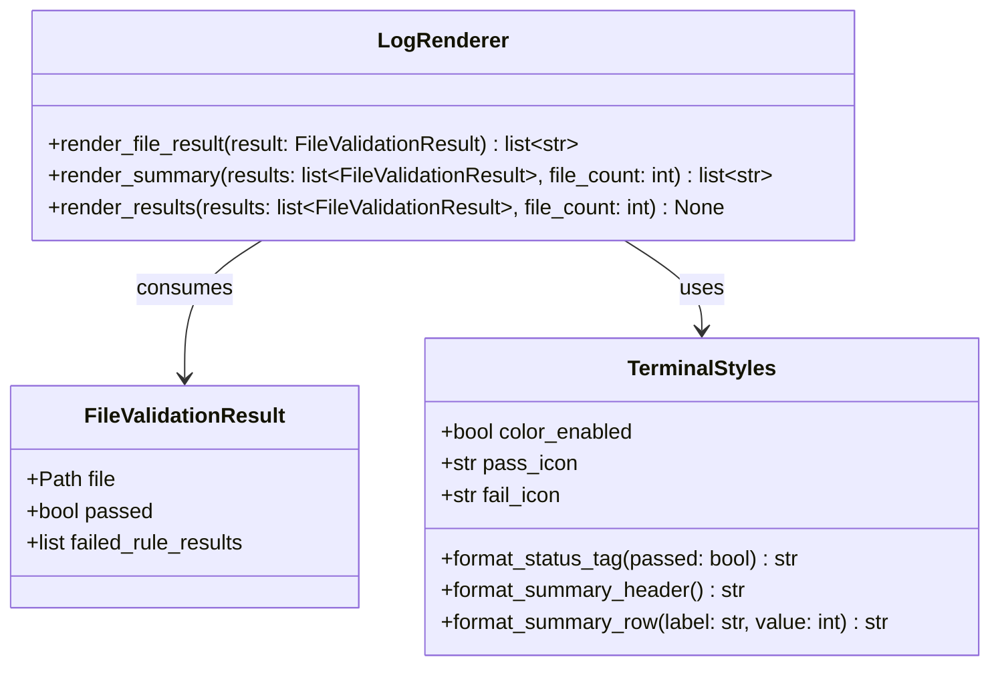

# Structured Logging Styling

## Requirements

Improve terminal validation output by styling per-file pass and fail status tags with Nerd Font icons, bracketed labels, and color, and by rendering the run summary under a `Validation Summary` section header with column-aligned metric labels and values, without changing validation behavior or domain models.

## Entities

## Approach

1. Renderer-only scope:
   - Change only `pipeline/logging/` presentation code.
   - Do not modify validation rules, runner, config schema, or CLI exit behavior.

2. Status tag styling:
   - Replace plain `PASS` / `FAILED` text with bracketed tags: `[PASS]` and `[FAILED]`.
   - Prefix each tag with a Nerd Font icon:
     - Pass: `\uf058` (Nerd Font `nf-fa-check`)
     - Fail: `\uf057` (Nerd Font `nf-fa-times_circle`)
   - Final visible shape: `{icon} [PASS]` and `{icon} [FAILED]` with one space between icon and bracketed label.
   - Color the full status token green for pass and red for fail when color is enabled.

3. Alignment preservation:
   - Replace the old 6-character plain status width with a computed fixed width based on the styled pass tag so all file paths still align in a second column separated by exactly 4 spaces.

4. Summary block styling:
   - Render the run summary after all per-file results (keep current order).
   - Use the section title `Validation Summary` (title case).
   - Print one blank line before the summary block.
   - Under the title, render rows in two columns:
     - Left column: metric labels (`Files processed`, `Passed`, `Failed`, `Failed rule checks`)
     - Right column: numeric values right-aligned
   - Compute left column width from the longest label plus spacing; use at least 2 spaces between columns.

5. Terminal styling implementation:
   - Add `pipeline/logging/terminal_styles.py` to centralize icons, color decisions, and formatted strings.
   - Use Rich `Text` or styled strings for color output; print through `typer.echo` with markup disabled when passing pre-styled Rich output, or use `rich.print` only inside the logging layer if simpler.
   - Disable color when `NO_COLOR` is set, when stdout is not a TTY, or when Rich indicates color should not be used.
   - When color is disabled, omit icons and render plain bracketed tags `[PASS]` / `[FAILED]` plus unstyled summary rows so CI logs stay readable.

6. Dependency:
   - Add `rich` as a direct runtime dependency via `uv add rich` because the logging layer will import it explicitly.

## Structure

### Inheritance Relationships

1. No new abstract types; styling helpers are plain functions or a small module of constants and formatters.

### Dependencies

1. `pipeline/logging/renderer.py` calls helpers in `pipeline/logging/terminal_styles.py`.
2. `pipeline/cli/app.py` continues to call `render_results` only; no new CLI options in this slice.
3. `pipeline/logging/renderer.py` continues to consume `FileValidationResult` from `pipeline.validation.models`.

### Layered Architecture

1. Validation Layer: unchanged; produces `FileValidationResult` objects.
2. Output Layer: renderer composes styled terminal lines and prints them.
3. Styling Layer: terminal icon, color, and column formatting helpers used exclusively by the renderer.

## Operations

### Add Dependency - `pyproject.toml`

1. Responsibility: Declare Rich as an intentional runtime dependency for styled terminal output.
2. Logic:
   - Run `uv add rich`.
   - Ensure lockfile updates with the project change.
3. Constraints:
   - Do not remove existing dependencies.

### Implement Terminal Styles - `pipeline/logging/terminal_styles.py`

1. Responsibility: Centralize Nerd Font icons, color enablement, and formatted status/summary strings.
2. Constants:
   - `PASS_ICON = "\uf058"`
   - `FAIL_ICON = "\uf057"`
   - `PASS_LABEL = "[PASS]"`
   - `FAIL_LABEL = "[FAILED]"`
   - `SUMMARY_TITLE = "Validation Summary"`
   - `SUMMARY_LABELS = ("Files processed", "Passed", "Failed", "Failed rule checks")`
3. Functions:
   - `color_enabled() -> bool`
     - Logic:
       - Return `False` when `NO_COLOR` is present in the environment.
       - Return `False` when stdout is not a TTY.
       - Otherwise return Rich/console color capability.
   - `format_status_tag(passed: bool) -> str`
     - Logic:
       - When color enabled: return a green or red styled string for `{icon} [PASS]` or `{icon} [FAILED]`.
       - When color disabled: return plain `[PASS]` or `[FAILED]` without icon.
   - `status_column_width() -> int`
     - Logic:
       - Return the visible width of the styled pass tag (including icon, brackets, and spaces) so the renderer can pad consistently.
   - `format_summary_header() -> str`
     - Logic:
       - Return `Validation Summary`.
       - When color enabled, render the title in bold; otherwise plain text.
   - `format_summary_rows(rows: list[tuple[str, int]]) -> list[str]`
     - Logic:
       - Accept ordered `(label, value)` pairs for the four summary metrics.
       - Compute `label_width = max(len(label) for label, _ in rows)`.
       - Render each row as `{label:<label_width}  {value:>value_width}` where `value_width` is at least 3 or the width of the largest value.
       - Do not use inline `Label: value` formatting.
4. Constraints:
   - Keep all Nerd Font codepoints in this module only.
   - Do not import validation models here.

### Update Log Renderer - `pipeline/logging/renderer.py`

1. Responsibility: Produce styled per-file output and a column-aligned summary block.
2. Methods:
   - `render_file_result(result: FileValidationResult) -> list[str]`
     - Logic:
       - Build the first line as `{status_tag:<status_width}{GAP}{file_path}` using `format_status_tag` and `status_column_width`.
       - Under every file, render one indented line per entry in `result.rule_results` (not only `failed_rule_results`) using `- {rule}: {message}`, so pass rows still show which rules ran and their messages.
       - Keep one blank line after each file block that has rule detail lines.
   - `render_summary(results: list[FileValidationResult], file_count: int) -> list[str]`
     - Logic:
       - Compute passed, failed, and failed rule check counts as today.
       - Return lines in order:
         - blank line
         - summary header from `format_summary_header()`
         - formatted summary rows from `format_summary_rows`
         - trailing blank line
   - `render_results(results: list[FileValidationResult], file_count: int) -> None`
     - Logic:
       - Print per-file results first, then summary lines.
       - Use `typer.echo` for plain strings; for styled status tags and header, echo the rendered string without adding extra markup that would break Rich styling.
3. Constraints:
   - Remove the old lowercase `Validation summary` header and `Label: value` summary lines.
   - Do not change discovery order of file results.

### Update Logging Package Exports - `pipeline/logging/__init__.py`

1. Responsibility: Keep public export surface unchanged unless new helpers must be exported.
2. Logic:
   - Continue exporting only `render_results`.
3. Constraints:
   - Do not export styling helpers publicly unless needed elsewhere.

### Verify CLI Output - manual smoke test

1. Responsibility: Confirm styled output works on the developer machine.
2. Logic:
   - Run `uv sync`.
   - Run `uv run pipeline explore` against the local `.env` dev directory.
   - Confirm pass lines show green `{icon} [PASS]` and failed lines show red `{icon} [FAILED]`.
   - Confirm file paths remain aligned.
   - Confirm summary appears last with `Validation Summary` header and column-aligned values.
   - Run with `NO_COLOR=1` and confirm plain bracketed tags without color or icons.
3. Constraints:
   - Do not change CLI options or exit code behavior.

## Norms

1. Module docstrings: Keep short module-level docstrings in new or updated logging files.
2. Styling ownership: All terminal color, icon, and column formatting lives under `pipeline/logging/`.
3. Domain boundaries: Logging consumes validation results; do not move or redefine validation models.
4. Dependency management: Use `uv add` for new runtime dependencies and `uv run` for commands.
5. Comments: Avoid redundant inline comments; prefer clear helper names.
6. Windows support: Rely on Rich/colorama behavior already used by Typer rather than custom Windows ANSI handling.

## Safeguards

1. Functional constraints:
   - Status tags must render as bracketed `[PASS]` / `[FAILED]`.
   - Colored output must use green for pass and red for fail when color is enabled.
   - Nerd Font icons must use the specified codepoints when color is enabled.
   - Summary section title must be exactly `Validation Summary`.
   - Summary metrics must use column alignment, not `Label: value` inline strings.
   - Per-file rule detail format remains indented bullet lines under every file for all severities (`info`, `warning`, `error`).

2. Non-regression constraints:
   - Validation rules, config loading, discovery, and exit codes must behave identically to the current implementation.
   - Summary remains after per-file output, not before.
   - `render_results` remains the only CLI-facing logging entry point.

3. Degradation constraints:
   - When color is disabled, output must remain readable without missing-glyph boxes.
   - Plain fallback must still include bracketed status tags and column-aligned summary values.

4. Scope constraints:
   - No new CLI flags, JSON config keys, or test suite requirements in this slice unless needed to prevent regression.
   - Do not restyle failed rule lines in this slice unless required for alignment.

5. Packaging constraints:
   - Keep the `pipeline` console script working after dependency and logging changes.

6. Documentation constraints:
   - Note in code comments or module docstring that Nerd Font icons expect a Nerd Font-patched terminal font when color mode is enabled.
