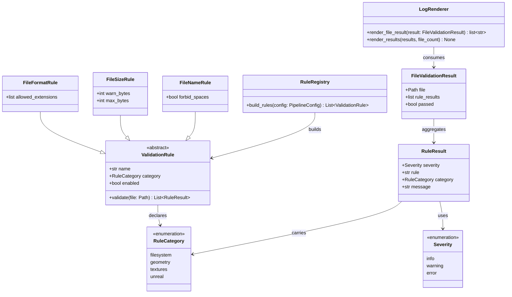

# Rule Categories and Framework Hardening

## Requirements

Harden the existing filesystem validator into a modular framework by making domain/context rule categories first-class metadata, enriching structured output with category and severity, clarifying rule registration/grouping, proving extensibility with one additional filesystem rule, and documenting how the framework is organized and extended — without implementing geometry, texture, or Unreal rule bodies yet.

## Entities

## Approach

1. Domain/context categories:
   - Treat categories as application/domain contexts, not per-check type labels.
   - Locked taxonomy: `filesystem`, `geometry`, `textures`, `unreal`.
   - All live rules in this cycle belong to `filesystem`.
   - `geometry`, `textures`, and `unreal` are reserved in the shared category enumeration and documented for later cycles.
   - Reject `format`/`size` as categories; those remain rule names under `filesystem`.

2. First-class metadata:
   - Category lives on the rule contract and on every `RuleResult`.
   - Severity already lives on `RuleResult`; structured terminal output must also print category and severity so each result clearly communicates: file, rule, category, severity, message.

3. Registration without overengineering:
   - Replace ad-hoc per-rule `if` blocks with a small declarative registration table that records rule name, category, and how to construct the rule from config.
   - Do not add plugin auto-discovery, entry points, or dynamic imports in this cycle.
   - Adding a rule should mean: implement the rule class, add defaults, add one registry entry, export if needed — not rewrite the runner or CLI.

4. Extension proof:
   - Add `file_name` under `filesystem` to prove a third rule can land with minimal core changes.
   - Configurable behavior: `enabled` and `forbid_spaces` (default true). Fail with `error` when the filename contains spaces and forbidding is enabled; otherwise emit `info`.

5. Documentation:
   - Expand README with architecture organization, category taxonomy (including reserved domains), how to add a rule, how registration works, and how to run the validator.
   - Keep SPDD prompts as design history; README is the project-facing architecture and extension note.

6. Explicit non-goals:
   - No manifold/winding geometry implementation.
   - No Unreal integration.
   - No category-level enable/disable config unless it stays trivial; per-rule `enabled` remains the control surface.

## Structure

### Inheritance Relationships

1. `ValidationRule` remains the abstract rule contract and gains a required `category` attribute of type `RuleCategory`.
2. `FileFormatRule`, `FileSizeRule`, and new `FileNameRule` implement `ValidationRule` and declare `category = filesystem`.
3. `RuleCategory` is a shared string enumeration used by rules, results, registry metadata, and docs.
4. `RuleResult` extends its fields to include `category` alongside existing `severity`, `rule`, and `message`.

### Dependencies

1. `pipeline/rules/registry.py` builds enabled rules from config using the declarative registration table.
2. Concrete builtins depend on `ValidationRule`, `RuleCategory`, `RuleResult`, and `Severity`.
3. `pipeline/validation/runner.py` continues to depend only on the `ValidationRule` interface and result models — no per-rule knowledge.
4. `pipeline/logging/renderer.py` consumes `FileValidationResult` / `RuleResult` and prints category and severity.
5. `pipeline/cli/app.py` remains thin orchestration and does not gain rule-specific logic.
6. README documents the taxonomy and extension path; it does not execute validation.

### Layered Architecture

1. Config Layer: defaults and JSON overrides for per-rule settings, including the new `file_name` rule.
2. Rules Layer: category enum, rule ABC, builtins, declarative registry.
3. Validation Layer: discovery, runner, result models including category on `RuleResult`.
4. Output Layer: renderer prints enriched per-rule metadata.
5. Docs Layer: README architecture and extension guide.

## Operations

### Define Rule Category Enumeration - `pipeline/validation/models.py` or `pipeline/rules/categories.py`

1. Responsibility: Provide the shared domain/context category taxonomy as first-class metadata.
2. Attributes:
   - `RuleCategory` enumeration with values `filesystem`, `geometry`, `textures`, `unreal`.
3. Constraints:
   - Prefer defining `RuleCategory` next to other validation shared types or in a small rules-facing module imported by both rules and results — avoid duplicating the enum.
   - Reserved categories must exist in the enumeration even with zero live rules.

### Update Validation Models - `pipeline/validation/models.py`

1. Responsibility: Carry category on every rule result so reporting can surface full metadata.
2. Attributes:
   - `RuleResult`: add `category: RuleCategory` beside existing `severity`, `rule`, and `message`.
   - Keep `FileValidationResult` pass/fail semantics unchanged: only `error` fails a file; `warning` and `info` do not.
3. Constraints:
   - Do not remove severity; it must remain available for rendering.
   - Category on results must match the emitting rule’s category.

### Update Rule Contract - `pipeline/rules/validation_rule.py`

1. Responsibility: Require every rule to declare its domain category.
2. Attributes:
   - `category: RuleCategory` on `ValidationRule`.
3. Constraints:
   - Concrete rules must set category as a class attribute (or equivalent stable declaration), not invent per-call categories.

### Update Existing Builtin Rules - `pipeline/rules/builtins/file_format.py`, `pipeline/rules/builtins/file_size.py`

1. Responsibility: Attach `filesystem` category and include it on every emitted `RuleResult`.
2. Logic:
   - Set `category = RuleCategory.FILESYSTEM` (or equivalent enum member for `filesystem`).
   - When constructing each `RuleResult`, pass the rule’s category.
3. Constraints:
   - Do not change existing pass/fail thresholds or messages except as needed to include category.

### Implement File Name Rule - `pipeline/rules/builtins/file_name.py`

1. Responsibility: Provide a third filesystem rule that validates filename hygiene using config outside the rule body.
2. Attributes:
   - `name = "file_name"`
   - `category = filesystem`
   - `forbid_spaces: bool`
3. Methods:
   - `validate(file: Path) -> list[RuleResult]`
     - Logic:
       - Inspect `file.name`.
       - If `forbid_spaces` is true and the name contains a space, return one `error` result with message indicating spaces are not allowed.
       - Otherwise return one `info` result confirming the filename passed the naming check.
4. Constraints:
   - Keep the rule filesystem-metadata-only; do not open or parse file contents.
   - Export from `pipeline/rules/builtins/__init__.py`.

### Update Defaults and Registry - `pipeline/config/defaults.py`, `pipeline/rules/registry.py`

1. Responsibility: Configure the new rule and replace hand-wired construction with declarative registration grouped by category metadata.
2. Defaults:
   - `rules.file_name.enabled = true`
   - `rules.file_name.forbid_spaces = true`
   - Preserve existing `file_format` and `file_size` defaults, including soft/hard size thresholds.
3. Registry:
   - Introduce a small declarative registration table/list of rule specs including at least: rule settings key/name, category, and constructor/factory using config settings.
   - `build_rules(config)` iterates the table, skips disabled rules, constructs enabled ones, and returns them in stable order: `file_format`, `file_size`, `file_name`.
4. Constraints:
   - No auto-discovery of modules.
   - Runner and CLI must not gain new per-rule branches.
   - Category for each registered builtin must be `filesystem`.

### Update Structured Output - `pipeline/logging/renderer.py`

1. Responsibility: Print category and severity for every rule result line.
2. Methods:
   - `render_file_result(result: FileValidationResult) -> list[str]`
     - Logic:
       - Keep the file summary line as styled PASS/FAILED plus path.
       - For each `RuleResult`, render an indented detail line that clearly includes rule name, category, severity, and message.
       - Suggested readable shape: `- [category] rule (severity): message`
       - Continue printing detail lines for all severities, including passing `info` results.
       - Keep a blank line after file blocks that have detail lines.
3. Constraints:
   - Do not drop existing summary metrics.
   - Do not require a second output format (JSON, etc.) in this cycle.

### Update README Architecture Note - `README.md`

1. Responsibility: Provide the project architecture / extension note.
2. Content to add:
   - How the framework is organized (cli, config, rules, validation, logging).
   - Domain category taxonomy: `filesystem`, `geometry`, `textures`, `unreal`, including which are live vs reserved.
   - How rules are added (implement rule, set category, add defaults, register in the declarative table).
   - How registration/grouping works at a high level.
   - How to run the validator (`uv run pipeline explore` and config/env basics).
3. Constraints:
   - Keep the note short and practical.
   - Do not claim geometry/Unreal rules are implemented.

### Verify Extension Path - manual smoke check

1. Responsibility: Confirm enriched output and the third rule work end-to-end.
2. Logic:
   - Run `uv run pipeline explore` against the local `.env` dev directory.
   - Confirm detail lines show category and severity.
   - Confirm `file_name` appears for discovered files.
   - Optionally spot-check a filename with a space if available, or reason about expected error behavior from the rule logic.
3. Constraints:
   - Do not add Unreal or mesh dependencies.

## Norms

1. Python tooling: Use `uv` for dependency and command execution; keep Typer CLI patterns.
2. Domain boundaries: Validation owns result models; rules own check logic; logging only renders; config owns defaults/overrides.
3. Category semantics: Categories are domain/context labels; rule names are specific checks inside a category.
4. Metadata consistency: Every `RuleResult` category must come from the emitting rule’s declared category.
5. Extensibility: Prefer adding a registry table entry over editing runner/CLI when introducing builtins.
6. Documentation: Module docstrings stay short; README carries the human architecture/extension story.
7. Comments: Minimal; explain non-obvious choices only.
8. Reserved domains: Encode reserved categories in the shared enumeration and README even before implementations exist.

## Safeguards

1. Functional constraints:
   - Category taxonomy must include at least `filesystem`, `geometry`, `textures`, and `unreal`.
   - Live rules in this cycle must all use `filesystem`.
   - Structured per-rule output must communicate file (via parent block), rule name, category, severity, and message.
   - At least three rules must exist after implementation: `file_format`, `file_size`, `file_name`.
   - Registration must be declarative/table-driven rather than unrelated scattered conditionals in the runner.
   - README must explain organization, categories, adding rules, registration, and how to run.

2. Non-regression constraints:
   - Existing explore flow, discovery, exit codes, and soft/hard size behavior must keep working.
   - `warning` still does not fail a file; only `error` does.
   - Optional JSON config without new keys must continue to work via defaults.

3. Scope constraints:
   - No Unreal API usage.
   - No geometry mesh parsing or manifold/winding implementation.
   - No plugin auto-discovery framework.
   - No rewrite of the overall package layout beyond what category/registration/output/docs require.

4. Design constraints:
   - Do not use per-check categories such as `format` or `size`.
   - Do not make categories folder-only without result metadata.
   - Prefer clarity over clever abstraction.

5. Verification constraints:
   - Run diagnostics on changed files where available.
   - Smoke-test `uv run pipeline explore` and confirm category/severity appear in output.
