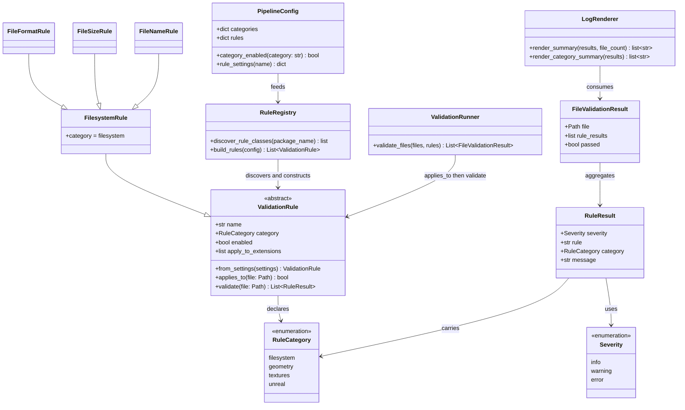

# Framework Stretch Enhancements

## Requirements

Extend the modular filesystem validator by enabling or disabling categories through configuration, reorganizing rules into category packages with category base classes, discovering concrete rules from those category packages, constructing rules with `from_settings`, adding a category-grouped run summary, and supporting simple extension-based conditional skipping — without Unreal integration, geometry content rule bodies, or external plugin entry points.

## Entities

## Approach

1. Category packages replace `builtins/`:
   - Live rules live under `pipeline/rules/filesystem/`.
   - Reserved packages `geometry/`, `textures/`, and `unreal/` hold category base classes only.
   - `builtins/` is removed.

2. Category identity from category base classes:
   - Each category package defines a base such as `FilesystemRule` that sets `category`.
   - Concrete rules subclass the local base; folder layout and base class stay aligned by convention.

3. Category-package discovery (replaces decorator registration):
   - For each enabled `RuleCategory`, import `pipeline.rules.<category>`.
   - Discover sibling modules in that package (skip `base` and private modules).
   - Collect concrete non-abstract `ValidationRule` subclasses whose `category` matches.
   - Sort discovered classes by `name` for stable order.
   - Do not use `@register_rule`, parent import lists, or `load_rule_packages()` side-effect bootstraps.
   - Do not use external plugin entry points; discovery is limited to in-repo category packages.

4. Construction via `from_settings`:
   - Each concrete rule implements `from_settings(settings)`.
   - `build_rules` calls `from_settings` after category/rule enable checks.

5. Rule-domain models:
   - `RuleCategory`, `Severity`, and `RuleResult` live in `pipeline/rules/models.py`.
   - `FileValidationResult` remains in `pipeline/validation/models.py` and aggregates rule results.
   - Config does not import rule models; `category_enabled` accepts a string key.

6. Category configuration:
   - Defaults: `filesystem: true`, `geometry/textures/unreal: false`.
   - Both category enabled and rule enabled must be true to construct a rule.
   - Disabled categories are not scanned.

7. Conditional skip:
   - Optional per-rule `apply_to_extensions` (empty/missing = all files).
   - Shared `applies_to(file)` on the rule contract; runner skips with no results when false.

8. Category summary:
   - Keep existing totals; add `By Category` for categories that emitted results (checks, errors, warnings).

9. Docs:
   - `ARCHITECTURE.md` describes category packages, discovery, `from_settings`, toggles, filters, and summary.

## Structure

### Inheritance Relationships

1. `ValidationRule` is the shared abstract contract.
2. Category bases (`FilesystemRule`, `GeometryRule`, `TexturesRule`, `UnrealRule`) subclass `ValidationRule` and fix `category`.
3. Live concrete rules subclass `FilesystemRule` and implement `from_settings` / `validate`.

### Dependencies

1. `pipeline/rules/models.py` owns `RuleCategory`, `Severity`, `RuleResult`.
2. `pipeline/validation/models.py` owns `FileValidationResult` and imports `RuleResult` / `Severity` from rules.
3. `registry.py` discovers modules under enabled category packages and constructs via `from_settings`.
4. Runner depends only on `ValidationRule` (`applies_to`, `validate`).
5. Renderer consumes `FileValidationResult` and rule severities/categories for summaries.
6. Config loader merges `categories` and `rules`; `PipelineConfig.category_enabled` takes `str` only (no rules import).

### Layered Architecture

1. Config Layer: category toggles and per-rule settings including `apply_to_extensions`.
2. Rules Layer: models, category packages, category bases, concrete rules, discovery registry.
3. Validation Layer: discovery of files, runner with conditional skip, file-level aggregation.
4. Output Layer: per-file details plus category summary.
5. Docs Layer: architecture extension guide.

## Operations

### Own Rule Models - `pipeline/rules/models.py`

1. Responsibility: Hold rule-domain vocabulary.
2. Types:
   - `Severity`: `info`, `warning`, `error`
   - `RuleCategory`: `filesystem`, `geometry`, `textures`, `unreal`
   - `RuleResult`: severity, rule, category, message
3. Constraints:
   - Validation must not redefine these types.

### Implement Category Discovery Registry - `pipeline/rules/registry.py`

1. Responsibility: Discover and construct rules from enabled category packages.
2. Methods:
   - `_discover_rule_classes(package_name) -> list[type[ValidationRule]]`
     - Import the package; iterate modules with `pkgutil`.
     - Skip `base` and private modules.
     - Collect concrete non-abstract `ValidationRule` subclasses.
     - Return classes sorted by `name`.
   - `build_rules(config) -> list[ValidationRule]`
     - For each `RuleCategory`, skip if category disabled.
     - Discover classes from `pipeline.rules.<category>`.
     - Skip rule if disabled or `rule_cls.category` mismatches.
     - Append `rule_cls.from_settings(settings)`.
3. Constraints:
   - No `@register_rule`, no `_REGISTERED_RULES`, no `load_rule_packages()`.
   - No `_build_*` per-rule factories.
   - No external entry-point plugins.

### Define Category Packages and Bases

1. Responsibility: Domain packaging for rules.
2. Layout:
   - `pipeline/rules/filesystem/` with `FilesystemRule` and live rule modules.
   - Reserved `geometry/`, `textures/`, `unreal/` with bases only.
3. Constraints:
   - Category `__init__` need not import every rule module for registration.
   - `builtins/` must remain removed.

### Update Rule Contract - `pipeline/rules/validation_rule.py`

1. Responsibility: Shared construction and skip behavior.
2. Include abstract `from_settings`, `apply_to_extensions`, and `applies_to(file)`.
3. Constraints:
   - Category remains declared on category base classes.

### Extend Configuration - `pipeline/config/defaults.py`, `models.py`, `loader.py`

1. Responsibility: Category toggles + optional extension filters.
2. Defaults include `categories` map and per-rule `apply_to_extensions: []`.
3. `PipelineConfig.category_enabled(category: str) -> bool`.
4. Loader deep-merges `categories` and `rules`.
5. Constraints:
   - Config must not import `pipeline.rules` (avoid circular imports).

### Honor Conditional Skip in Runner - `pipeline/validation/runner.py`

1. Responsibility: Skip non-applicable rules per file via `applies_to`.
2. Constraints:
   - All-skipped file remains passed with no detail lines.

### Add Category Summary - `pipeline/logging/renderer.py`

1. Responsibility: `By Category` metrics after existing summary totals.
2. Constraints:
   - Only categories with emitted results; keep Validation Summary totals.

### Update Architecture Docs - `ARCHITECTURE.md`

1. Responsibility: Document category packages, module discovery, `from_settings`, toggles, filters, summary, and model ownership.
2. Constraints:
   - Adding a rule is “new module in category package + defaults,” not decorator/import bootstrap.

### Verify Behavior - manual smoke check

1. Defaults discover filesystem rules and show category summary.
2. Disabling `categories.filesystem` yields no rules.
3. `apply_to_extensions` skips mismatched files.
4. No decorator/`load_rule_packages` remain.

## Norms

1. Use `uv` and existing Typer/project conventions.
2. Category folders and category base classes stay aligned.
3. Category packages are the catalog via local module discovery.
4. Construction stays on the rule via `from_settings`.
5. Runner/CLI remain free of concrete rule class knowledge.
6. Rule outcome types live in rules; file aggregation lives in validation.
7. Update architecture docs with structural changes.
8. Prefer clarity over cleverness; no external plugin systems.

## Safeguards

1. Functional constraints:
   - Live rules reside under `rules/filesystem/` and subclass `FilesystemRule`.
   - New rule modules in an enabled category package are discoverable without parent import lists or decorators.
   - Category disable suppresses scanning/construction for that category.
   - `from_settings` is required for concrete rules.
   - `apply_to_extensions` empty/missing means all files.
   - Category summary only includes categories with emitted results.

2. Non-regression constraints:
   - Default explore behavior remains equivalent aside from intentional summary/packaging changes.
   - Exit codes remain error-driven.
   - Old JSON without new keys still works.

3. Scope constraints:
   - No Unreal APIs or geometry mesh parsing.
   - Discovery limited to in-repo `pipeline.rules.<category>` packages.
   - Reserved category packages must not pretend to implement real checks.

4. Design constraints:
   - Do not keep `builtins/` alongside category packages.
   - Do not use decorator side-effect registration as the primary catalog mechanism.
   - Do not parse `__module__` strings as the primary category source of truth; category base classes own category identity.
   - Avoid config → rules import cycles.
