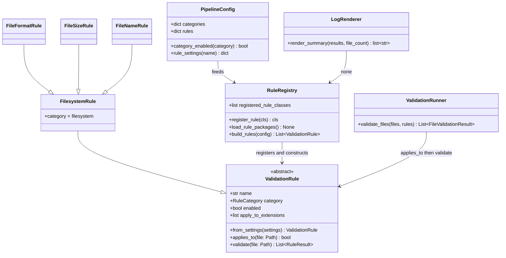

# Framework Stretch Enhancements

## Requirements

Extend the modular filesystem validator by enabling or disabling categories through configuration, reorganizing rules into category packages with category base classes, registering rules via a decorator bootstrapped by category-package imports, constructing rules with `from_settings`, adding a category-grouped run summary, and supporting simple extension-based conditional skipping — without Unreal integration, geometry content rule bodies, or plugin auto-discovery.

## Entities

## Approach

1. Category packages replace `builtins/`:
   - Move live rules into `pipeline/rules/filesystem/`.
   - Add reserved packages `geometry/`, `textures/`, and `unreal/` with category base classes (and no live rule bodies yet unless needed for package validity).
   - Remove `pipeline/rules/builtins/` after the move.

2. Category identity from category base classes:
   - Each category package defines a base such as `FilesystemRule` that sets `category = RuleCategory.FILESYSTEM`.
   - Concrete rules subclass the base in their package; they do not independently invent category values.
   - Folder layout and base class stay aligned by convention.

3. Decorator registration with explicit import bootstrap:
   - Provide `@register_rule` that appends the class to an ordered registry list when the module is imported.
   - Each category package `__init__` imports its concrete rule modules so decorators run.
   - Registry loads category packages explicitly (import filesystem always for now; reserved packages may be imported for base availability or deferred until they have rules — prefer importing package modules in a stable listed order).
   - Document that forgetting to import a new rule module means it will not register.
   - Do not scan packages dynamically and do not use entry points.

4. Construction via `from_settings`:
   - Each concrete rule implements `from_settings(settings)`.
   - `build_rules` walks registered classes, applies category/rule enable gates, then calls `from_settings`.
   - Remove `RuleSpec` / `_build_*` factory helpers.

5. Category configuration:
   - Top-level defaults: `categories.filesystem = true`, `geometry/textures/unreal = false`.
   - Both category enabled and rule enabled must be true to construct/run a rule.

6. Conditional skip:
   - Optional per-rule `apply_to_extensions` (empty/missing = all files).
   - Shared `applies_to(file)` on the rule contract; runner skips with no results when false.

7. Category summary:
   - Keep existing totals; add a `By Category` section for categories that emitted at least one result, showing checks, errors, and warnings.

8. Docs:
   - Update `ARCHITECTURE.md` for category packages, base classes, decorator bootstrap, `from_settings`, category toggles, extension filters, and category summary.

## Structure

### Inheritance Relationships

1. `ValidationRule` is the shared abstract contract (`name`, `category`, `enabled`, `apply_to_extensions`, `from_settings`, `applies_to`, `validate`).
2. `FilesystemRule` (and reserved category bases) subclass `ValidationRule` and fix `category`.
3. `FileFormatRule`, `FileSizeRule`, and `FileNameRule` subclass `FilesystemRule` and use `@register_rule`.

### Dependencies

1. Decorator/registry module is importable by rule modules without circular import failures.
2. Category package `__init__` imports concrete rule modules for side-effect registration.
3. `build_rules` depends on registered classes + `PipelineConfig` gates + `from_settings`.
4. Runner depends only on `ValidationRule` (`applies_to`, `validate`).
5. Renderer aggregates results by category for the new summary section.
6. Config loader merges `categories` and `rules`.

### Layered Architecture

1. Config Layer: category toggles and per-rule settings including `apply_to_extensions`.
2. Rules Layer: category packages, category bases, concrete rules, decorator registry.
3. Validation Layer: runner with conditional skip.
4. Output Layer: per-file details plus category summary.
5. Docs Layer: architecture extension guide.

## Operations

### Introduce Registry Decorator API - `pipeline/rules/registry.py` (or split `registration.py` if needed to avoid import cycles)

1. Responsibility: Own registration list and rule package bootstrap.
2. Methods / API:
   - `register_rule(cls)` decorator appends class to an ordered list if not already present and returns cls.
   - `load_rule_packages()` imports category packages in stable order so decorators run.
   - `build_rules(config)` calls `load_rule_packages()`, then for each registered class: skip if category disabled or rule disabled; otherwise append `cls.from_settings(settings)`.
3. Constraints:
   - No `_build_*` helpers.
   - No dynamic filesystem package scanning.
   - Preserve deterministic order via documented import order in category `__init__` files and package load order.

### Define Category Base Classes and Packages

1. Responsibility: Replace `builtins/` with domain packages.
2. Create:
   - `pipeline/rules/filesystem/` with `FilesystemRule` base and moved `file_format`, `file_size`, `file_name` modules.
   - `pipeline/rules/geometry/`, `textures/`, `unreal/` with category base classes only (reserved).
3. Logic:
   - Update each live rule to subclass `FilesystemRule`, keep `@register_rule`, implement `from_settings`, preserve validation behavior, include optional `apply_to_extensions`.
   - Category package `__init__` imports concrete rule modules for filesystem; reserved packages export their base class.
4. Constraints:
   - Delete old `pipeline/rules/builtins/` modules after migration.
   - Update any exports/imports that referenced builtins.

### Update Rule Contract - `pipeline/rules/validation_rule.py`

1. Responsibility: Shared construction and skip behavior.
2. Add abstract class method `from_settings(settings)`.
3. Add `apply_to_extensions` support and `applies_to(file)` as specified in prior stretch design (empty list => all files).
4. Constraints:
   - Category remains declared on category base classes for live rules.

### Extend Configuration - `pipeline/config/defaults.py`, `models.py`, `loader.py`

1. Responsibility: Category toggles + optional extension filters.
2. Defaults:
   - `categories.filesystem = true`
   - `categories.geometry = false`
   - `categories.textures = false`
   - `categories.unreal = false`
   - Per-rule settings keep existing keys; `apply_to_extensions` defaults to empty list / all files.
3. `PipelineConfig` gains `categories` and `category_enabled(...)`.
4. Loader deep-merges `categories` and `rules`.
5. Constraints:
   - Missing `categories` in JSON uses defaults.

### Honor Conditional Skip in Runner - `pipeline/validation/runner.py`

1. Responsibility: Skip non-applicable rules per file.
2. Logic: if not `rule.applies_to(file)`, continue; else validate as today.
3. Constraints:
   - All-skipped file remains passed with no detail lines.

### Add Category Summary - `pipeline/logging/renderer.py` (+ styles helpers if useful)

1. Responsibility: Group metrics by category after existing summary totals.
2. Logic: aggregate checks/errors/warnings for categories present in results; omit empty categories.
3. Constraints:
   - Do not remove existing Validation Summary totals.

### Update Architecture Docs - `ARCHITECTURE.md` (+ README pointer if needed)

1. Responsibility: Explain category packages, base classes, decorator bootstrap (imports required), `from_settings`, category config, extension filters, category summary.
2. Constraints:
   - Explicitly warn that a rule module must be imported by its category package to register.
   - No assignment framing.

### Verify Behavior - manual smoke check

1. Defaults still validate filesystem rules and show filesystem category summary.
2. Disabling `categories.filesystem` yields no selected rules / existing warning path.
3. A non-matching `apply_to_extensions` skips that rule’s output for mismatched files.
4. Confirm `builtins/` is gone and rules import from category packages.
5. Confirm no `_build_*` factories remain.

## Norms

1. Use `uv` and existing Typer/project conventions.
2. Category folders and category base classes stay aligned.
3. Registration is decorator + explicit imports; never rely on accidental imports.
4. Construction stays on the rule via `from_settings`.
5. Runner/CLI remain free of concrete rule class knowledge.
6. Update architecture docs with structural changes.
7. Prefer clarity over cleverness; no plugin scanning.

## Safeguards

1. Functional constraints:
   - Live rules reside under `rules/filesystem/` and subclass `FilesystemRule`.
   - `@register_rule` + category package imports are required for a rule to be available.
   - Category disable suppresses all rules in that category.
   - `from_settings` is required for registered concrete rules.
   - `apply_to_extensions` empty/missing means all files.
   - Category summary only includes categories with emitted results.

2. Non-regression constraints:
   - Default explore behavior for current assets remains equivalent aside from intentional new summary section and packaging paths.
   - Exit codes remain error-driven.
   - Old JSON without new keys still works.

3. Scope constraints:
   - No Unreal APIs or geometry mesh parsing.
   - No dynamic plugin discovery.
   - Reserved category packages must not pretend to implement real checks.

4. Design constraints:
   - Do not keep `builtins/` alongside category packages.
   - Do not parse `__module__` strings as the primary category source of truth.
   - Avoid circular imports between decorator definition and rule modules.
