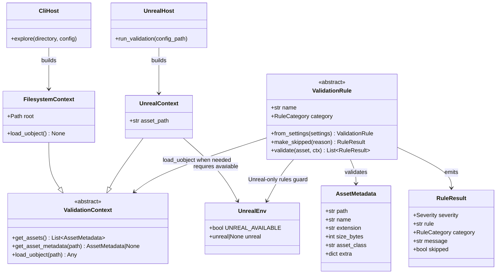

# Validation Context and Unreal Host

## Requirements

Enable the same validation core to run from the CLI via `uv` and from Unreal Engine editor Python by introducing a shared asset-metadata currency and a thin validation-context seam (`get_assets` / `get_asset_metadata` / `load_uobject`), so rules consume normalized facts instead of assuming on-disk paths, while keeping host/entrypoint identity separate from rule categories and preserving current filesystem explore behavior.

## Entities

## Approach

1. Shared core in `pipeline/core/`: `AssetMetadata`, context ABC, `FilesystemContext`, runner, `AssetValidationResult`.
2. Unreal host in `pipeline/unreal/`: `env.py` (import-time `UNREAL_AVAILABLE`), `UnrealContext`, entry, log emit.
3. CLI in `pipeline/cli/app.py`: Typer, dotenv, directory resolve, ANSI print via `report`.
4. Reporting in `pipeline/report/`: shared emoji formatter; summary includes skipped rule checks.
5. Rules set `category` on each class (no category base classes). Discovery via `registry.build_rules`.
6. Unreal-only rules (`geometry`, `textures`): guard `UNREAL_AVAILABLE` → `make_skipped(...)` (never fails asset); when available, `load_uobject` + engine APIs in the rule module.
7. Host ≠ rule category (config-driven). Fixed Unreal discovery root `/Game/ExampleContent`.

## Structure

1. `pipeline/core/` — host-agnostic validation types and runner.
2. `pipeline/unreal/` — editor host; `env.py` is the Python-only vs Unreal boundary.
3. `pipeline/cli/` — filesystem host wiring only.
4. `pipeline/rules/` — policy (+ Unreal API calls for Unreal-only rules).
5. `pipeline/config/` — defaults + loader (`ConfigError`, `PipelineConfig` in `loader.py`).
6. `pipeline/report/` — shared formatting (+ optional CLI ANSI helpers).

## Operations

Implemented layout after prune:

- Renamed `validation/` → `core/`, `logging/` → `report/`, `hosts/unreal/` → `unreal/`.
- Folded thin CLI/config modules; removed category `base.py` files.
- `UNREAL_AVAILABLE` + `RuleResult.skipped` + summary skipped counts.
- Unreal-only query logic lives in rule modules (not a central `queries.py`, not on the ABC).

## Norms

1. Use `uv` / Typer for CLI.
2. Keep context ABC to discovery + `load_uobject`.
3. Evaluate Unreal availability once in `unreal/env.py`; do not lazy-import ad hoc in every helper.
4. Skipped results never fail an asset.
5. Only `pipeline/cli/` imports `typer` / `python-dotenv`.
6. Update `ARCHITECTURE.md` / `RULES.md` when seams or rule catalog change.

## Safeguards

1. Shared runner is the only rule-application loop.
2. CLI explore works without engine `unreal` (`UNREAL_AVAILABLE` false).
3. `UnrealContext` fails at construction when Unreal is unavailable.
4. Default CLI keeps unreal/geometry/textures categories off.
5. Do not grow the ABC with per-rule engine methods.
