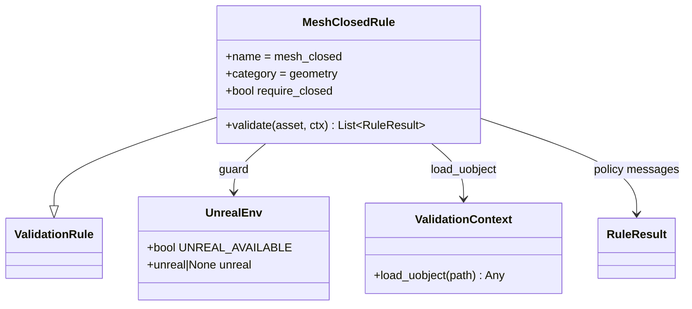

# Geometry Mesh Closed Rule

## Requirements

Add a configurable `geometry` rule that checks whether Unreal static meshes are topologically closed, reporting open-border diagnostics and ambiguous topology without treating every open mesh as an unconditional error.

## Entities

## Approach

1. Context stays discovery + `load_uobject` only.
2. `pipeline/unreal/env.py` sets `UNREAL_AVAILABLE` once at import.
3. Rule guards with `UNREAL_AVAILABLE` → explicit `make_skipped("Unreal Engine not available.")` (never a failure).
4. When available: `ctx.load_uobject` + private DynamicMesh helpers in `mesh_closed.py` (copy LOD 0, query closedness / border edges / loops / ambiguity).
5. Wrong asset type or query failure → no results (avoid spam).
6. `require_closed` gates open-mesh errors; ambiguous topology warns.
7. Geometry off by default for CLI; Unreal execute-script config enables it.

## Structure

- `pipeline/rules/geometry/mesh_closed.py` — guard, DynamicMesh query helpers, policy result helpers
- `pipeline/unreal/env.py` — availability flag
- `pipeline/config/defaults.py` — `rules.mesh_closed` (`require_closed: true`)

## Operations

1. Register under `geometry` via category package discovery.
2. Implement guard + DynamicMesh closedness in the rule module.
3. Emit info/error/warning per policy; skipped when Unreal unavailable.
4. Document in `RULES.md` / ARCHITECTURE.

## Norms

1. Do not grow the ABC with mesh methods.
2. Do not invent a central `queries.py` that accumulates every Unreal check.
3. Engine API noise stays in the Unreal-only rule that needs it.

## Safeguards

1. Skips never fail the asset.
2. Static meshes + LOD 0 only.
3. Default CLI keeps `categories.geometry: false`.
4. CLI with geometry enabled surfaces skipped counts when Unreal is absent.
