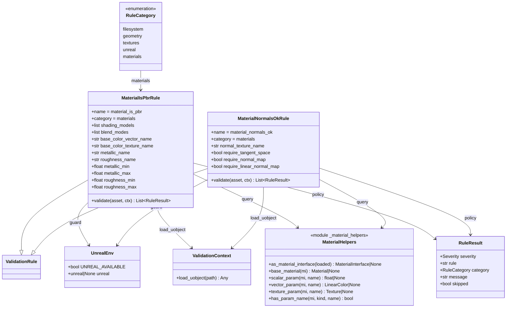

# Materials PBR and Normals Validation

## Requirements

Add a Unreal-hosted `materials` validation category that gates CAD→USD→Unreal look by checking whether Content Browser materials follow a named-parameter PBR convention and have correct material-side normals — without USD disk parsing, material mutation, or a broad materials hygiene suite.

## Entities



## Approach

1. Category and discovery:
   - Add `materials` to `RuleCategory` and `categories.materials: false` in defaults.
   - Package `pipeline/rules/materials/` discovered like other categories; private `_material_helpers.py` is skipped by registry (`_` prefix).
   - Enable `materials` in `scripts/unreal_validate_config.json` alongside geometry/textures/unreal for Unreal smoke runs.

2. Convention-first Unreal Python checks:
   - Assume shared parent Material + Material Instances with stable parameter names.
   - Use `MaterialEditingLibrary` for parameter name lists and scalar/vector/texture values; use base `Material` properties for domain, blend, shading model, `tangent_space_normal`.
   - Support both `Material` and `MaterialInstance` / `MaterialInstanceConstant` via `MaterialInterface`. Wrong types → no results.
   - Do not walk StaticMesh slots; only validate material assets discovered under `host.content_root`.

3. Rule split:
   - `material_is_pbr`: **PBR shape gate** first — domain Surface, shading in allowlist (default Default Lit), blend in allowlist (default Opaque). If any gate fails → explicit `[SKIPPED]` result (`Not detected as PBR (...); ...`) that does not fail the asset. If shape matches → BaseColor present as vector **or** texture param; Metallic and Roughness scalar params present and in [0, 1].
   - `material_normals_ok`: optional require tangent-space on base Material; Normal texture param; if bound, require non-sRGB when `require_linear_normal_map`; missing Normal only errors when `require_normal_map` (default false).

4. Unavailable / missing tooling:
   - `UNREAL_AVAILABLE` false → single skipped result (never fails).
   - MaterialEditingLibrary unavailable or query throws → skipped or empty results with logged warning in helpers; do not crash the run.
   - Missing required PBR params on a PBR-shaped material → **error** (no silent pass).
   - Non-PBR-shaped materials → **skipped** with reason (not silent, not error).

5. Explicit non-goals:
   - No USD shade validation, no material creation/fix, no mesh tangent checks, no dedupe/usage-flag suite.

## Structure

### Inheritance Relationships

1. `MaterialIsPbrRule` and `MaterialNormalsOkRule` subclass `ValidationRule` with `category = RuleCategory.MATERIALS`.
2. `RuleCategory` gains `MATERIALS = "materials"`.
3. Helpers remain a private module, not a `ValidationRule` subclass.

### Dependencies

1. Both rules → `pipeline.unreal.env` for availability guard.
2. Both rules → `ValidationContext.load_uobject`.
3. Both rules → `_material_helpers` for MaterialInterface / MaterialEditingLibrary access.
4. `build_rules` discovers the package when `categories.materials` is true; no registry table edits beyond enum + package.

### Layered Architecture

1. Config: category toggle + per-rule settings in `defaults.py`.
2. Rules: policy and severity decisions only.
3. Helpers: engine query noise (isinstance, MEL getters, texture sRGB).
4. Docs: `RULES.md` + `ARCHITECTURE.md` category lists.

## Operations

### Update enum / defaults / Unreal smoke config

1. Responsibility: Make `materials` a first-class category, off for CLI, on for Unreal execute script.
2. Changes:
   - `pipeline/rules/models.py`: add `MATERIALS = "materials"`.
   - `pipeline/config/defaults.py`: `"materials": False` under `categories`; add rule defaults below.
   - `scripts/unreal_validate_config.json`: `"materials": true`.
3. Default rule settings:

```json
"material_is_pbr": {
  "enabled": true,
  "shading_models": ["DefaultLit"],
  "blend_modes": ["Opaque"],
  "base_color_vector_name": "BaseColor",
  "base_color_texture_name": "BaseColor",
  "metallic_name": "Metallic",
  "roughness_name": "Roughness",
  "metallic_min": 0.0,
  "metallic_max": 1.0,
  "roughness_min": 0.0,
  "roughness_max": 1.0,
  "apply_to_extensions": []
},
"material_normals_ok": {
  "enabled": true,
  "normal_texture_name": "Normal",
  "require_tangent_space": true,
  "require_normal_map": false,
  "require_linear_normal_map": true,
  "apply_to_extensions": []
}
```

4. Note: BaseColor vector and texture names may be identical; presence of either param kind named that string satisfies base color. If studios split names later, set distinct strings in JSON.

### Create helpers - `pipeline/rules/materials/_material_helpers.py`

1. Responsibility: Safe Unreal material queries; no policy severity.
2. Functions:
   - `as_material_interface(loaded) -> Any | None`: None if not MaterialInterface.
   - `get_base_material(mi) -> Any | None`: `mi.get_base_material()` with try/except.
   - `list_scalar_names` / `list_vector_names` / `list_texture_names` via MaterialEditingLibrary.
   - `get_scalar(mi, name) -> float | None`: MI path uses `get_material_instance_scalar_parameter_value` when instance; else `get_material_default_scalar_parameter_value` on base Material. Return None if name absent or call fails.
   - `get_vector` / `get_texture` analogs.
   - `texture_is_srgb(texture) -> bool | None`: read Texture2D `srgb` / editor property; None if unreadable.
3. Constraints: Import `unreal` only through `pipeline.unreal.env`; never mutate materials; never call recompile APIs.

### Create rule - `material_is_pbr`

1. Responsibility: Enforce Surface + allowlisted shading/blend + named PBR params in range.
2. `validate(asset, ctx)`:
   - If not `UNREAL_AVAILABLE`: return `[make_skipped("Unreal Engine not available.")]`.
   - `loaded = ctx.load_uobject(asset.path)`; if not material interface: return `[]`.
   - Resolve base Material; if missing: error “could not resolve base Material”.
   - **PBR shape gate:** read `material_domain`, `shading_model`, `blend_mode`. If domain is not Surface, or shading/blend outside configured allowlists → `make_skipped("Not detected as PBR (...); ...")` (does not fail the asset). Compare enums via normalized tokens that accept Unreal reprs like `<MaterialDomain.MD_SURFACE: 0>`.
   - Only after shape matches: Base color error if neither vector nor texture param exists; Metallic / Roughness error if missing or out of range.
   - If all pass: single info “Material satisfies PBR convention”.
3. Multiple param failures: return one `RuleResult` per distinct failure (clear messages), not a single opaque blob.

### Create rule - `material_normals_ok`

1. Responsibility: Tangent-space + Normal map binding / linear color space policy.
2. `validate(asset, ctx)`:
   - Same Unreal skip + MaterialInterface gate as PBR rule.
   - If `require_tangent_space` and base Material `tangent_space_normal` is false: error.
   - Look up texture param `normal_texture_name`.
   - If missing and `require_normal_map`: error; if missing and not required: info “No Normal map parameter (not required)” (or omit info to reduce noise — prefer one info when category is exercised).
   - If present but texture is None/null: error “Normal parameter unbound”.
   - If present and `require_linear_normal_map` and `texture_is_srgb` is True: error “Normal map is sRGB; expected linear”.
   - If present and sRGB unreadable: warning.
   - If all applicable checks pass: info “Material normals OK”.
3. Do not fail CAD solids with no Normal map when `require_normal_map` is false.

### Package init + documentation

1. Add `pipeline/rules/materials/__init__.py` (empty or package docstring only).
2. Update `ARCHITECTURE.md`: include `materials` in domain rule packages / package map.
3. Update `RULES.md`: category row + both rules’ settings/behavior; note Unreal smoke config enables materials; note named-parameter convention dependency.

### Verification checklist (implementer)

1. Category discovery picks up both rules when enabled.
2. CLI default config does not enable materials.
3. With Unreal absent and materials forced on: skipped results, asset not failed.
4. Non-material assets: no PBR/normals spam.
5. Docs match defaults.

## Norms

1. Match Unreal-only rule style of `texture_max_resolution` / `mesh_closed`: availability guard, `load_uobject`, wrong type → `[]`, skips never fail.
2. Do not grow `ValidationContext` with material methods; keep engine noise in `_material_helpers` + rule modules.
3. Do not invent a cross-domain `queries.py`.
4. Parameter names and allowlists come from settings, not hardcoded-only constants (defaults may match convention strings).
5. Use `uv` / existing package layout; Typer CLI unchanged.
6. Keep `RULES.md` and `ARCHITECTURE.md` in sync with the new category.
7. No material writes, recompiles, or import-pipeline changes.

## Safeguards

1. Functional: Validation only; no asset mutation.
2. Scope: MaterialInterface assets only; no mesh-slot traversal; no USD CLI shade checks.
3. PBR: Missing Metallic/Roughness/BaseColor params on a PBR-shaped material are errors (no silent pass). Non-PBR-shaped materials (wrong domain / shading / blend) are `[SKIPPED]` with an explicit “Not detected as PBR” reason — never silent, never a failure.
4. Normals: `require_normal_map` defaults false so CAD color materials without maps do not mass-fail; bound Normal maps that are sRGB fail when `require_linear_normal_map` is true.
5. Host: Skipped results never fail the asset; default CLI keeps `categories.materials: false`.
6. Integration: Existing filesystem/geometry/textures/unreal behavior unchanged when materials is off.
7. Technical: Prefer read-only MaterialEditingLibrary getters; if MEL unavailable, skip rather than crash. Enum allowlist matching must accept Unreal Python enum reprs (`<Enum.NAME: n>`).
8. Config: Shading default allowlist is Default Lit; blend default allowlist is Opaque for v1 (extend via JSON later).
