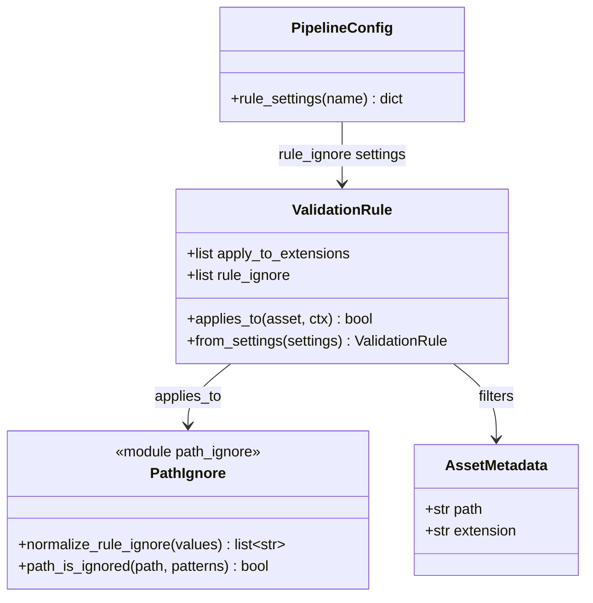

# Shared rule_ignore Path Filtering

## Requirements

Add a shared per-rule `rule_ignore` path-filter so operators can mark assets out of scope for a rule (gitignore-style “allowed through”), without treating those assets as policy passes or failures, and without a materials-only fork.

## Entities

## Approach

1. Framework gate (not materials-only):
   - Add `rule_ignore: list[str]` beside `apply_to_extensions` on `ValidationRule`.
   - Extend `applies_to` so a path matching any pattern returns `False` (runner never calls `validate`).
   - Quiet not-applicable: no `RuleResult`, no `[SKIPPED]` (reserve skipped for host/capability gaps).

2. Pattern dialect (stdlib-only, v1):
   - Glob-style patterns against full `AssetMetadata.path` with `/` separators.
   - Support `*`, `?`, and `**` (directory-spanning) via a small `pipeline/rules/path_ignore.py` helper — no new dependency.
   - No gitignore negation (`!`), comments, or `.ruleignore` files in this cycle.
   - Case-sensitive matching on the path string as stored (Unreal `/Game/...` and filesystem paths as produced by hosts).
   - Match path only (not `asset.name` alone).

3. Wiring all rules:
   - Every concrete rule’s `__init__` / `from_settings` accepts `rule_ignore` (default `[]`).
   - Shared helpers: `normalize_rule_ignore`, optional `common_filter_kwargs(settings)` to avoid drift.
   - Defaults: `"rule_ignore": []` on every rule block in `defaults.py`.

4. Docs / example:
   - Document under Shared rule options in `RULES.md` with examples (`/Game/UI/**`, `**/Fonts/**`).
   - Optional: show materials `rule_ignore` example in comments or Unreal smoke config — patterns empty by default so behavior unchanged until configured.

5. Non-goals:
   - Category-level shared ignore lists, `.ruleignore` files, ignore audit INFO spam, materials domain-policy changes.

## Structure

### Inheritance Relationships

1. `ValidationRule` gains `rule_ignore` and ignore-aware `applies_to`.
2. All concrete rules continue to subclass `ValidationRule` and pass `rule_ignore` from settings.
3. `path_ignore` is a pure helper module (not a rule).

### Dependencies

1. `ValidationRule.applies_to` → `path_is_ignored(asset.path, self.rule_ignore)`.
2. Concrete `from_settings` → `normalize_rule_ignore(settings.get("rule_ignore"))`.
3. Runner unchanged (already respects `applies_to`).

### Layered Architecture

1. Config JSON → per-rule `rule_ignore` lists.
2. Rule base applicability → extension + ignore gates.
3. Rule `validate` → policy only.

## Operations

### Create `pipeline/rules/path_ignore.py`

1. Responsibility: Normalize patterns and test path membership.
2. Functions:
   - `normalize_rule_ignore(values: list[str] | None) -> list[str]`: coerce to `str`, strip, drop empties; preserve order; default `[]`.
   - `normalize_path_for_match(path: str) -> str`: replace `\\` with `/`; strip trailing `/` except root-like paths; do not alter case.
   - `path_is_ignored(path: str, patterns: list[str]) -> bool`: True if any pattern matches.
3. Matching rules:
   - Normalize path and each pattern to `/`.
   - A pattern matches if:
     - `fnmatch.fnmatchcase(normalized_path, pattern)`, or
     - after expanding `**` semantics: implement recursive glob match so `/Game/UI/**` matches `/Game/UI/Foo/Bar` and `/Game/UI/Foo`.
   - Prefer a small explicit `**` matcher (segment walk) over adding packages.
4. Constraints: stdlib only (`fnmatch` + string splits); no I/O.

### Update `ValidationRule` in `validation_rule.py`

1. Add attribute `rule_ignore: list[str]` (default conceptually empty).
2. Update `applies_to`:
   - Keep extension filter.
   - If `path_is_ignored(asset.path, self.rule_ignore)`: return `False`.
   - Else return `True` when extensions allow.
3. Add helper for subclasses, e.g. `common_filter_kwargs(settings) -> dict` returning `apply_to_extensions` and `rule_ignore` normalized — use in every `from_settings`.

### Wire every concrete rule

1. For each rule module under `filesystem`, `geometry`, `textures`, `unreal`, `materials`:
   - Add `rule_ignore` param to `__init__`, store on `self`.
   - Pass `rule_ignore=settings.get("rule_ignore")` (via `common_filter_kwargs` or `normalize_rule_ignore`) in `from_settings`.
2. No changes to `validate` bodies required when ignore is handled in `applies_to`.

### Update `defaults.py` and docs

1. Add `"rule_ignore": []` to every rule settings dict in `DEFAULT_CONFIG`.
2. `RULES.md` Shared rule options:
   - Document `rule_ignore` (list of globs; empty = none).
   - Note quiet not-applicable semantics and `**` examples for Unreal UI/font paths.
   - Clarify ignored ≠ passed and ignored ≠ host `[SKIPPED]`.
3. Brief note in `ARCHITECTURE.md` How to add a rule: load `rule_ignore` like `apply_to_extensions`.

### Verification checklist

1. Empty `rule_ignore` → behavior unchanged.
2. Pattern `/Game/UI/**` → materials (or any) rule does not run on `/Game/UI/Foo`.
3. Extension filter and `rule_ignore` both apply (either can exclude).
4. No new package dependencies in `pyproject.toml`.
5. CLI/Unreal runners need no code changes beyond rules/defaults/docs.

## Norms

1. Name everything `rule_ignore` (config key + attribute), not allowlist/denylist/ruleignore.
2. Keep matching in one helper module; do not duplicate globs inside rule classes.
3. Prefer quiet exclusion via `applies_to`; do not emit per-ignored-asset INFO by default.
4. Stdlib only for this cycle; no gitignore library.
5. Update all rules in one pass so no rule silently lacks the setting.
6. Keep `uv` / Typer / package layout unchanged.

## Safeguards

1. Functional: Ignore never marks an asset as policy success or failure for that rule.
2. Semantics: Host `skipped` remains distinct from ignore not-applicable.
3. Defaults: Empty lists preserve today’s behavior.
4. Scope: Per-rule lists only; no `.ruleignore` file; no `!` negation in v1.
5. Matching: Full `asset.path` only; case-sensitive; `/`-normalized.
6. Dependencies: Do not add runtime packages for globbing.
7. Integration: Runner contract stays `applies_to` then `validate`; do not bypass the runner gate inside individual Unreal rules.
