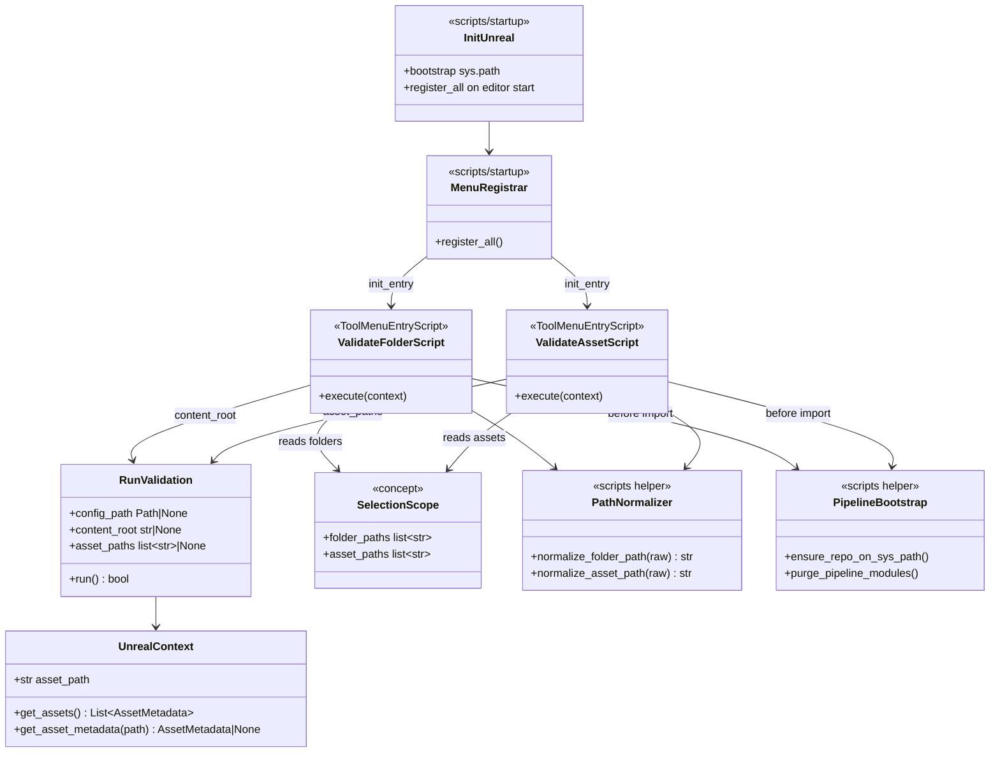

# Unreal Content Browser Validation Menus

## Requirements

Expose the existing Unreal validation host through Content Browser folder and asset context menus so editors can validate a selected folder or selected assets in-place, while keeping validator core / Unreal host / editor UX layers clearly separated and easy to navigate. Prefer a CLI-launched editor session (with `UE_PYTHONPATH` wired for startup menu registration) over a manual Execute-Script validation smoke entry.

## Entities

## Approach

1. Layering (organization-first):
   - `pipeline/core|rules|config|report` — validator (unchanged policy).
   - `pipeline/unreal` — Unreal *validation host* (extend `run_validation` only).
   - `scripts/startup` — Unreal *editor UX* (`init_unreal.py`, `register_menus.py`, thin helpers).
   - `scripts/unreal_validate.py` — manual Execute Python Script entry (keep working; share bootstrap helpers where practical).
   - Menus never import rules/config internals; they call `pipeline.unreal.run_validation` after bootstrap.

2. Host API extension (Option B):
   - Extend `run_validation(config_path=None, content_root=None, asset_paths=None) -> bool`.
   - If `asset_paths` is provided (non-empty): resolve each path via `UnrealContext.get_asset_metadata`, skip recursive `get_assets()`, validate that list only.
   - Else: existing behavior — discover under `content_root` or config `host.content_root`.
   - If both `content_root` and `asset_paths` are provided: prefer `asset_paths` and ignore `content_root` for discovery (document this). Empty `asset_paths` list → warn and return success without running rules.
   - Unresolved paths (metadata `None`) → warn per path and omit; if none resolve, warn and return success.
   - Keep shared `load_config` / `build_rules` / `validate_assets` / `format_results` / `emit_lines` path for both modes.

3. Editor UX (`scripts/startup/`):
   - Paths are always derived from `__file__` once our code loads (repo root / config / startup dir). No hard-coded machine paths.
   - **`UE_PYTHONPATH` ≠ editor executable.** It is a list of directories Unreal searches for Python startup modules (`init_unreal.py`). Editor binary path and `.uproject` path are separate.
   - Primary UX: CLI launches Unreal with `UE_PYTHONPATH` pointing at `scripts/startup` so `init_unreal.py` registers menus on editor start.
   - `scripts/unreal_validate.py` is a **menus-only** Execute Script fallback (register via `__file__`); it does **not** run validation.
   - `init_unreal.py`: ensure repo root on `sys.path`, soft-fail `register_all()` when startup dir is on Unreal’s Python path.
   - `register_menus.py`: `@unreal.uclass()` `ToolMenuEntryScript` subclasses for folder and asset menus; `@unreal.ufunction(override=True) execute(self, context)` with Unreal-injected `context` only.
   - Folder menu: `ContentBrowser.FolderContextMenu`, section `PathViewFolderOptions`, label e.g. `Validate Folder`.
   - Asset menu: `ContentBrowser.AssetContextMenu`, use a stable common section (e.g. `CommonAssetActions` or version-appropriate equivalent), label e.g. `Validate Assets`.
   - Selection: folders via `EditorUtilityLibrary.get_selected_path_view_folder_paths()`; assets via selected asset data / object paths from EditorUtilityLibrary.
   - Multi-select folders: one `run_validation` **per folder** (clear per-root log blocks).
   - Multi-select assets: **one** `run_validation(asset_paths=[...])` for the whole selection.
   - Normalize folder paths: strip leading `/All` when present so `/All/Game/Foo` → `/Game/Foo`.
   - Normalize asset paths to object paths UnrealContext understands (`/Game/Path/Asset.Asset`); skip/warn on failures.

4. Reload / bootstrap:
   - Extract shared helpers used by Execute Script and menus: ensure repo root on `sys.path`; purge `pipeline` / `pipeline.*` from `sys.modules` before importing `pipeline.unreal`.
   - Menu modules themselves are not purged on each click (UClass lifetime); only validator package modules are refreshed.
   - Guard against duplicate menu registration if `init_unreal` runs more than once (module-level registered flag).

5. Docs:
   - Update `README.md` and `ARCHITECTURE.md`: layering diagram, `UE_PYTHONPATH` → `scripts/startup`, menu usage, `asset_paths` on `run_validation`, reload note.
   - Do not invent a second config; menus use `scripts/unreal_validate_config.json`.

## Structure

### Inheritance Relationships

1. `ValidateFolderScript` / `ValidateAssetScript` subclass `unreal.ToolMenuEntryScript`.
2. No new types inside `pipeline/core` or `pipeline/rules` for this feature.

### Dependencies

1. `scripts/startup/init_unreal.py` → `register_menus.register_all`.
2. Menu `execute` → bootstrap helpers → `pipeline.unreal.run_validation`.
3. `run_validation` → `load_config` / `UnrealContext` / `build_rules` / `validate_assets` / `format_results` / `emit_lines`.
4. CLI (`pipeline/cli`) does not depend on `scripts/startup`.

### Layered Architecture

1. Validator core: host-agnostic rules and runner.
2. Unreal validation host (`pipeline/unreal`): discovery + scoped run + log emit.
3. Unreal editor UX (`scripts/startup`): ToolMenus + startup hook only.
4. Manual Unreal entry (`scripts/unreal_validate.py`): menus-only Execute Script fallback via `__file__`.
5. CLI host: split modules under `pipeline/cli/`; `validate` (filesystem, renamed from `explore`); `editor` (interactive GUI or `--cmd` one-shot Unreal validation).

## Operations

### Refactor CLI package

1. Split `app.py` into thin Typer wiring + `validate.py` + `editor.py` + small shared env/path helpers.
2. Rename command `explore` → `validate` (same behavior).
3. `editor` interactive: launch `UnrealEditor` + `.uproject`; set `UE_PYTHONPATH` to `scripts/startup` when unset.
4. `editor --cmd`: resolve `UnrealEditor-Cmd` (from `--editor` name swap or env), run `-ExecutePythonScript=scripts/unreal_run_validation.py`, wait, propagate exit code. No menu registration required for this path.
5. Add `scripts/unreal_run_validation.py`: bootstrap + `run_validation` with sidecar config (Cmd / automation entry).

### Update Host API - `pipeline/unreal/entry.py`

1. Responsibility: Single Unreal validation door for folder-scoped and asset-scoped runs.
2. Signature: `run_validation(config_path=None, content_root=None, asset_paths=None) -> bool`
3. Logic:
   - Resolve config as today.
   - Build `UnrealContext` with `content_root or pipeline_config.content_root` as `asset_path` (nominal root even in asset mode).
   - Build rules; if none, warn and return `True`.
   - If `asset_paths` is not `None`:
     - Normalize/trim inputs; for each path call `ctx.get_asset_metadata`; collect resolved assets; warn on misses.
     - If zero resolved assets: warn and return `True`.
     - Else `validate_assets(resolved, rules, ctx)` then format/emit.
   - Else: `assets = ctx.get_assets()` then validate/format/emit as today.
4. Constraints: no ToolMenu imports; no Content Browser APIs in this module.

### Update Export - `pipeline/unreal/__init__.py`

1. Keep exporting `run_validation` (signature change only; lazy export unchanged).

### Create Helper - `scripts/startup/bootstrap.py` (or shared `scripts/_unreal_bootstrap.py`)

1. Responsibility: `sys.path` repo-root insert + `pipeline*` `sys.modules` purge.
2. Methods:
   - `ensure_repo_on_sys_path(repo_root: Path) -> None`
   - `purge_pipeline_modules() -> None`
3. `scripts/unreal_validate.py` uses bootstrap and registers menus only (no `run_validation`).

### Create Editor UX - `scripts/startup/register_menus.py`

1. Responsibility: Define and register Content Browser menu entries.
2. Classes:
   - `ValidateFolderScript(ToolMenuEntryScript)` with `execute(self, context)`:
     - Read selected folder paths; if empty, warn and return.
     - Bootstrap + purge + import `run_validation`.
     - For each folder: normalize path; `run_validation(config_path=sidecar, content_root=folder)`.
   - `ValidateAssetScript(ToolMenuEntryScript)` with `execute(self, context)`:
     - Read selected asset object paths; if empty, warn and return.
     - Bootstrap + purge + import `run_validation`.
     - `run_validation(config_path=sidecar, asset_paths=normalized_list)`.
3. `register_all()`:
   - Idempotent (skip if already registered).
   - `init_entry` + `register_menu_entry` for folder and asset menus with `unreal.Name` / `unreal.Text`.
4. Config path: resolve `scripts/unreal_validate_config.json` relative to repo/`scripts` the same way Execute Script does.
5. Constraints: never instantiate menu `context`; call only `pipeline.unreal.run_validation` for validation work.

### Create Startup Hook - `scripts/startup/init_unreal.py`

1. Responsibility: Auto-run on editor start when directory is on `UE_PYTHONPATH`.
2. Logic:
   - Ensure repo root on `sys.path` (parent of `scripts/`).
   - `try: register_all()` except log error with `[Validator]` prefix; do not raise.
3. Keep module import side-effect minimal and safe for repeated loads.

### Update Docs - `README.md`, `ARCHITECTURE.md`

1. Document Unreal surfaces: CLI editor launch, Content Browser menus, menus-only Execute Script fallback, `run_validation` API.
2. Clarify `UE_PYTHONPATH` (Python startup dirs) vs editor path vs `.uproject` path.
3. Document layering: validator vs Unreal host vs editor UX.
4. Keep module-reload guidance; note menus purge `pipeline*` on execute.

### Out of scope this cycle

1. New validation rules or config schema keys.
2. Placing ToolMenu classes inside `pipeline/`.
3. Custom Unreal Editor mode / dockable results UI (Output Log only).
4. Auto-discovering Unreal install location on disk (caller supplies editor path or env).

## Norms

1. Prefer organization clarity over avoiding all `pipeline/` diffs: host API may grow; menu UX stays in `scripts/startup/`.
2. Use `uv` for non-Unreal Python work; Unreal runs use embedded interpreter + `sys.path` bootstrap.
3. Menus call only `pipeline.unreal.run_validation` after purge/import — no duplicated validate/format/emit in scripts.
4. Follow Unreal Python menu pattern: `@unreal.uclass()`, `@unreal.ufunction(override=True)` on `execute`, `init_entry` + `register_menu_entry`.
5. Log prefixes use `[Validator]` for menu/startup messages; validation result lines keep existing shared formatter.
6. Update `ARCHITECTURE.md` / `README.md` when host seams or Unreal entrypoints change.
7. Match existing project style: concise modules, explicit path helpers, no second report model.

## Safeguards

1. Functional: Folder menu validates only under selected folder root(s); asset menu validates only selected assets (no recursive sibling discovery).
2. Functional: Execute Script entry remains usable and equivalent for default config root.
3. Integration: `pipeline/cli` and `uv run pipeline` work without `scripts/startup` or editor menus.
4. Integration: Soft-fail menu registration — editor startup must not crash if registration throws.
5. Technical: Do not reload/purge the `unreal` engine module; only `pipeline*`.
6. Technical: Do not manually construct ToolMenu `context`.
7. Technical: Idempotent registration avoids duplicate menu entries.
8. API: `asset_paths` mode must not call recursive `get_assets()` for the selection.
9. API: Missing config file still raises `FileNotFoundError` from `run_validation` (menus may catch and log).
10. Docs: Layering and `UE_PYTHONPATH` setup are documented before considering the cycle done.
11. Business: Reuse `scripts/unreal_validate_config.json` — no parallel menu-only policy file.
